# Editable flows

## The discovery loop

Conceptual workflow: proposals become useful through evidence and accountable decisions.

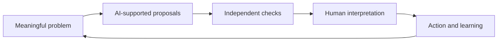

## A bounded research agent

Tool access and a stopping condition are explicit parts of the system.

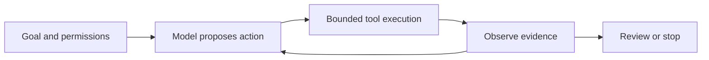

## Questions for evaluating a claim

Different disciplines use different acceptance standards. These are questions, not a universal linear ranking.

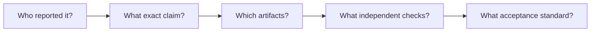

## Preserve the mathematical scope

Interpretation guide; this package does not certify a mathematical proof.

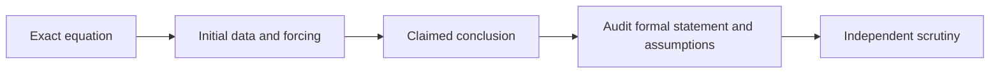

## Verification gate

Use checks capable of rejecting a generated result; select the reviewer and criteria before acting.

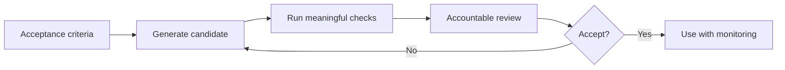

## Distinct scientific questions

A shape prediction does not by itself identify function, mechanism or therapeutic benefit.

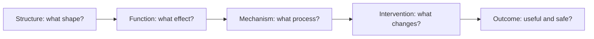

## Generic drug discovery evidence gates

A simplified educational pipeline; stages and regulatory requirements differ by product and jurisdiction.

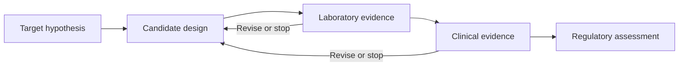

## Wave Intelligence: proposed mechanism workflow

Original explanatory adaptation of Liu’s repository perspective, pp. 3–6; a research agenda, not an established validated system.

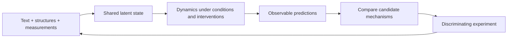

## Candidate search with an evaluator

Conceptual abstraction of tool-connected discovery; simulation and physical validation can have different requirements.

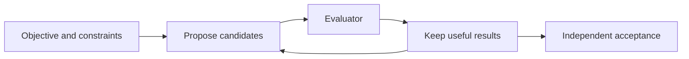

## Measure complete software work

Generation time is only one component. Acceptance includes review and integration.

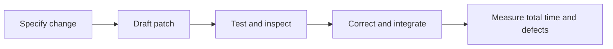

## Grounded knowledge work

The final decision owner checks material claims and the completeness of the evidence.

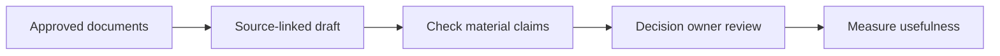

## Choose a pilot inside your domain

Illustrative suggestions for alumni; no claims about an existing DUT alumni program.

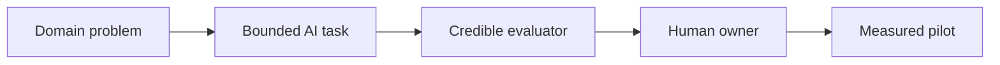

## A durable skill portfolio

Recommended capabilities to practice together, rather than a forecast of job counts.

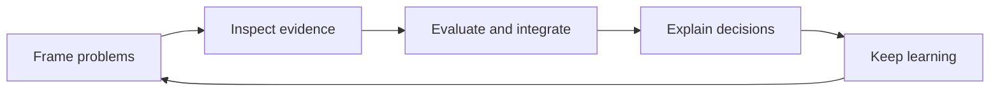

## Match autonomy to consequence

Suggested decision aid, not a numeric risk model or legal determination.

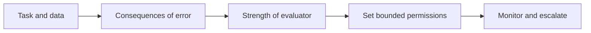

## A 30-day alumni pilot

Recommended schedule. Expand, revise and stop are all legitimate outcomes.

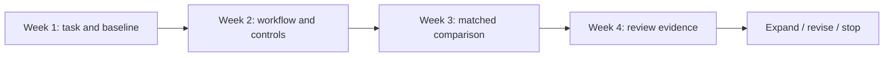

## From a paper to a checked prototype

An educational audit: derivatives checked, two claims need correction, and synthetic comparisons do not establish a production winner.

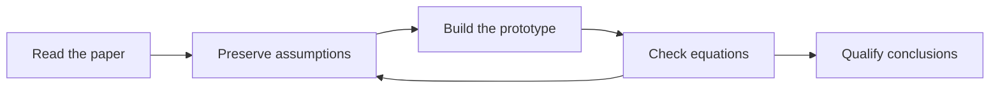
