# Timed speaker notes — 30 minutes

**AI at the Frontier of Discovery: Opportunities and Challenges in the LLM Era**

English script with English key takeaways. Timing includes pauses, diagram explanation,
brief interactions and a short panel handoff. The schedule is a rehearsal target, not
a guarantee of reading speed. Rehearse aloud and trim to your pace.

## Run of show

| Slide | Window | Title |
| --- | --- | --- |
| 1 | 00:00–01:30 | What changes when AI can help us discover? |
| 2 | 01:30–03:30 | A model becomes useful through a system |
| 3 | 03:30–05:30 | Read the evidence before repeating the headline |
| 4 | 05:30–08:00 | Navier–Stokes: a precise, attributed frontier claim |
| 5 | 08:00–10:00 | Verification is infrastructure for discovery |
| 6 | 10:00–12:00 | Scientific AI is a broader ecosystem than LLMs |
| 7 | 12:00–14:00 | Drug discovery still ends in evidence from people |
| 8 | 14:00–16:00 | From prediction and generation to testable mechanisms |
| 9 | 16:00–17:30 | Research agents need feedback from the world |
| 10 | 17:30–19:30 | In software, measure the whole task |
| 11 | 19:30–21:00 | Knowledge work depends on context and quality |
| 12 | 21:00–23:00 | Find the opportunity inside your discipline |
| 13 | 23:00–25:00 | Build the skills that make assistance dependable |
| 14 | 25:00–26:30 | Match autonomy to consequences |
| 15 | 26:30–28:00 | Run one measured pilot in the next 30 days |
| 16 | 28:00–30:00 | More ideas. Stronger evidence. Human responsibility. |

## 1. What changes when AI can help us discover?

**Window:** 00:00–01:30. **Evidence label:** Framing.

**Key takeaway:** When AI participates in discovery, where does our value lie?

### On screen

- AI is entering parts of the research process.
- The opportunity is broader than faster writing.
- Our role: define worthwhile problems and establish trustworthy answers.

### Suggested spoken script

Good afternoon, fellow Dalian University of Technology alumni. Let me begin with a practical question. If an AI system can help propose a proof, design an experiment, write software and prepare a technical report, where does our professional value move? For an engineering community, this question is especially concrete. Our work connects ideas to things that must function in the world. A beautiful answer is useful only when the design works, the evidence holds and someone can take responsibility for the result. Today I want to connect the frontier of AI research to those everyday responsibilities. We will look at mathematics, molecular science, research agents and professional work. We will also distinguish demonstrated results from proposed frameworks and from our own career recommendations. My central argument is that AI expands the space of ideas we can explore, while making verification more important. Please keep one task from your own work in mind throughout the talk. It might be a simulation, a literature review, a customer question or a difficult software change. At the end, I hope you can identify one useful experiment to run on that task.

**Delivery cue:** Pause and invite the audience to think of one task; do not request confidential examples.

### Visual flow

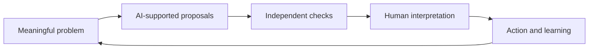

Conceptual workflow: proposals become useful through evidence and accountable decisions.

## 2. A model becomes useful through a system

**Window:** 01:30–03:30. **Evidence label:** Explanation.

**Key takeaway:** Tools, data and verification turn model capabilities into value.

### On screen

- LLM: generates language and other learned representations.
- Reasoning workflow: spends effort exploring and checking steps.
- Agent: uses tools, observes results and chooses further actions.
- A fluent explanation does not establish correctness.

### Suggested spoken script

We need a few distinctions before we discuss breakthroughs. A large language model learns patterns in training data and produces outputs conditioned on its input. Those outputs can include explanations, code and candidate plans. A reasoning workflow can spend additional computation exploring intermediate steps or trying alternatives. An agent wraps a model in a loop: it chooses a tool, examines the result and decides what to do next. The complete system may include retrieval, code execution, memory, specialized scientific models and human review. These are related ideas, but they describe different parts of a system. More time spent reasoning can help with some tasks; it does not create a guarantee. Retrieval can bring relevant documents into view; it does not ensure that every retrieved statement is true. Several agents can explore different approaches; agreement among them can still reflect a shared error. Notice the feedback loop on the diagram. The most consequential part is what happens after a proposal. Does the system run a meaningful test? Does it obtain a new measurement? Does it revise the proposal when the evidence disagrees? That loop is what connects a language interface to useful scientific and engineering work.

**Delivery cue:** Walk through the loop once. Define tools as calculators, search, tests or controlled equipment.

### Visual flow

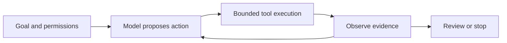

Tool access and a stopping condition are explicit parts of the system.

**Evidence:** [Boiko et al.: Autonomous chemical research with large language models](https://www.nature.com/articles/s41586-023-06792-0), [Google DeepMind: AlphaEvolve](https://deepmind.google/blog/alphaevolve-a-gemini-powered-coding-agent-for-designing-advanced-algorithms/)

## 3. Read the evidence before repeating the headline

**Window:** 03:30–05:30. **Evidence label:** Recommendation.

**Key takeaway:** Evaluate the evidence before repeating the claim.

### On screen

- Ask who made the claim and when.
- Read the exact problem and assumptions.
- Locate the paper, code, data or certificate.
- Separate artifact checking, scientific acceptance and practical usefulness.

### Suggested spoken script

A useful habit at the frontier is to ask what kind of evidence a claim has. A report from the organization that developed a system is valuable, but it is also a report by an interested party. A research manuscript gives us details to examine. A reproducible artifact lets other people test some of those details. Independent specialists can investigate whether the result addresses the intended question. These activities are related, but they are not interchangeable. In formal mathematics, a proof assistant can check a precisely expressed theorem using its logical rules and admitted assumptions. We still need to inspect the theorem statement, definitions, dependencies and correspondence with the original mathematical question. In experimental science, even perfectly executed code does not establish that a measurement is valid or that a result generalizes. In business, a successful demonstration does not establish that a workflow saves money after review and integration. My suggested question is simple: what would change your confidence? If no possible test could change it, you may be reacting to a narrative rather than evaluating a result. This is an essential professional skill because the volume of plausible technical claims can grow much faster than our capacity to inspect them.

**Delivery cue:** Use the evidence diagram as questions to ask, not a universal ranking of all disciplines.

### Visual flow

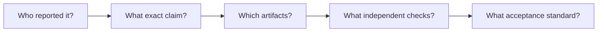

Different disciplines use different acceptance standards. These are questions, not a universal linear ranking.

**Evidence:** [Clay Mathematics Institute: Navier–Stokes Equation](https://www.claymath.org/millennium/navier-stokes-equation/), [Clay: Rules for the Millennium Prize Problems](https://www.claymath.org/millennium-problems/rules/), [OpenAI: NavierStokesAndEuler Lean certificates](https://github.com/openai/NavierStokesAndEuler)

## 4. Navier–Stokes: a precise, attributed frontier claim

**Window:** 05:30–08:00. **Evidence label:** Reported result.

**Key takeaway:** Mathematical progress needs precise claims and independent scrutiny.

### On screen

- OpenAI announced a proposed solution on September 8, 2026.
- The manuscript constructs finite-time blowup with smooth forcing and positive viscosity.
- The exact forced formulation matters.
- Independent acceptance and prize recognition are separate.

### Suggested spoken script

OpenAI announced a proposed Navier–Stokes solution on September eighth, twenty twenty-six. Its manuscript describes finite-time blowup with positive viscosity, smooth external forcing, zero initial velocity and bounded kinetic energy. It also released Lean formalizations. Clay’s page still displayed Active when checked on October second. The package has not independently audited the proof or established mathematical consensus. That is the precise frontier claim I want us to examine.

Here is why the distinctions matter beyond this particular announcement. Engineers work with mathematical models whose assumptions specify the domain in which a conclusion applies. Change the assumptions and you may change the question. A singularity in a continuum equation concerns the behavior of the model. It does not mean a physical fluid literally acquires an infinite speed, or that every industrial flow calculation has become invalid. A result addressing one mathematical formulation should be discussed with that formulation visible. Similarly, formal verification concerns an expressed mathematical object. The broader interpretation requires careful correspondence between that object and the question we care about. The professional lesson is to preserve scope when a result travels from a paper to a presentation and then into a decision. Responsible excitement should help us examine stronger evidence. It should not remove the conditions attached to a conclusion.

**Delivery cue:** Give approximately 30 seconds to the equation and assumptions. Keep the exact formulation visible.

### Visual flow

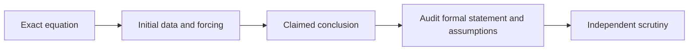

Interpretation guide; this package does not certify a mathematical proof.

**Evidence:** [OpenAI: On the Navier–Stokes Millennium Prize Problem](https://openai.com/index/navier-stokes-solution/), [OpenAI: Finite time blowup for Navier–Stokes](https://cdn.openai.com/pdf/32d9f210-8b73-45e0-91bc-82a30aef8a9a/navier-stokes.pdf), [OpenAI: NavierStokesAndEuler Lean certificates](https://github.com/openai/NavierStokesAndEuler), [Clay Mathematics Institute: Navier–Stokes Equation](https://www.claymath.org/millennium/navier-stokes-equation/), [Clay: Rules for the Millennium Prize Problems](https://www.claymath.org/millennium-problems/rules/)

## 5. Verification is infrastructure for discovery

**Window:** 08:00–10:00. **Evidence label:** Recommendation.

**Key takeaway:** Build verification into the infrastructure.

### On screen

- Specify what a valid answer must satisfy.
- Use checks that can reject the proposal.
- Keep provenance, assumptions and failure cases.
- Spend verification effort where errors matter most.

### Suggested spoken script

What makes an ambitious AI workflow credible is a verification environment that can reject its outputs. Suppose an engineer asks a model to improve a design. If the only evaluator is another model asked whether the design looks good, we have a weak feedback signal. A better environment can test constraints, inspect units, compare with a trusted baseline, examine edge cases and require a qualified person to review the result. Different disciplines have different standards. A proof needs a valid argument. A software patch needs meaningful tests and integration review. A scientific hypothesis needs predictions that can be confronted with observations. A treatment needs clinical evidence under the appropriate standards. We should therefore build verification into the workflow from the beginning. Specify the acceptance criteria before generating candidates. Record where the input data came from. Preserve failed attempts because they reveal the boundary of capability. Make it possible to stop, roll back or escalate. These controls are also opportunities. Alumni with expertise in measurement, test design, scientific computing and quality assurance can help turn impressive model outputs into dependable systems. Verification is a source of productive work, because a faster stream of proposals needs a stronger process for determining which ones deserve action.

**Delivery cue:** Ask the audience to name a check in their own field, silently or with one brief response.

### Visual flow

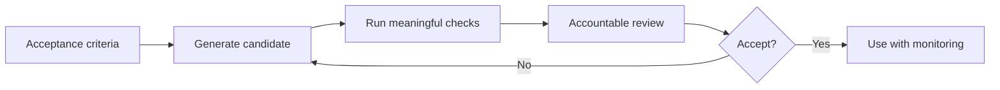

Use checks capable of rejecting a generated result; select the reviewer and criteria before acting.

**Evidence:** [NIST: Generative Artificial Intelligence Profile, AI 600-1](https://nvlpubs.nist.gov/nistpubs/ai/NIST.AI.600-1.pdf)

## 6. Scientific AI is a broader ecosystem than LLMs

**Window:** 10:00–12:00. **Evidence label:** Peer-reviewed evidence.

**Key takeaway:** Scientific AI extends beyond large language models.

### On screen

- AlphaFold 3 predicts structures of biomolecular complexes.
- Specialized predictors and generators support different tasks.
- LLMs can help connect literature, code and tools.
- Structure, function, mechanism and clinical benefit require different evidence.

### Suggested spoken script

The LLM era is part of a wider scientific AI ecosystem. AlphaFold three is a useful example: it predicts structures of complexes involving several kinds of biomolecules. It is a specialized biomolecular model, rather than a general chatbot that has independently solved biology. Its outputs can help prioritize experiments and interpret observations. A structure prediction alone does not establish biological function or therapeutic benefit.

For our purposes, think about how different tools cooperate in a research process. One tool estimates a property. Another proposes a structure. A language model helps locate relevant literature, assemble an analysis script or explain a technical result. A scientist determines whether the task and measurements are well chosen. An experiment supplies evidence that the computational process cannot invent. This division of work matters when we talk about opportunities. You do not need to train a frontier foundation model to improve a scientific workflow. You may create value by connecting domain data to a useful evaluator, improving measurement quality or making the output understandable to a practitioner. But the interfaces need care. If a generated report blurs the difference between a predicted structure and an experimentally measured effect, the workflow can become less trustworthy even while it becomes faster. Preserve the distinction between what the model estimated and what the world has shown.

**Delivery cue:** Explain the four distinct questions: what shape, what effect, what process, what patient outcome.

### Visual flow

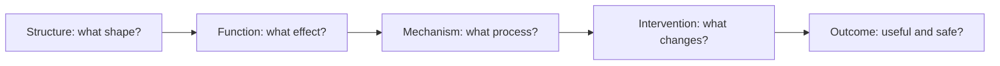

A shape prediction does not by itself identify function, mechanism or therapeutic benefit.

**Evidence:** [Abramson et al.: Accurate structure prediction of biomolecular interactions with AlphaFold 3](https://www.nature.com/articles/s41586-024-07487-w)

## 7. Drug discovery still ends in evidence from people

**Window:** 12:00–14:00. **Evidence label:** Peer-reviewed evidence.

**Key takeaway:** A candidate molecule still needs clinical evidence.

### On screen

- AI can support target selection and candidate design.
- Rentosertib has a published phase 2a IPF trial.
- That study involved 71 patients and a 12-week treatment period.
- Its primary objective was safety and tolerability; broader benefit needs further evidence.

### Suggested spoken script

Drug discovery makes the evidence problem especially clear. Generative methods can help explore candidates, while specialized models can estimate properties worth investigating. Rentosertib provides a concrete clinical example: a published phase two a study in idiopathic pulmonary fibrosis involved seventy-one patients over twelve weeks, with safety and tolerability as the primary objective. This is evidence of a candidate reaching clinical testing. It is not, by itself, proof of durable benefit or regulatory approval.

Look at the gates on the diagram. A candidate must be investigated for activity, selectivity, toxicity, manufacturing feasibility and ultimately effects in people. An attractive computational score addresses only part of that process. Failure at a later gate is informative, but costly. For alumni working in chemistry, manufacturing, software or healthcare, this creates several practical opportunities. Better data management can make experimental results reusable. Better modeling can help choose a more informative next experiment. Better documentation can help teams understand why a candidate was selected and what remains unknown. These improvements can reduce avoidable work without pretending that a laboratory assay is equivalent to a clinical outcome. When talking about AI-designed medicines, always say which part of the pipeline AI influenced and which stage the candidate has actually reached. That wording lets the audience appreciate progress while understanding the work that remains.

**Delivery cue:** Label the diagram a generic pipeline; do not imply this is the complete regulatory pathway.

### Visual flow

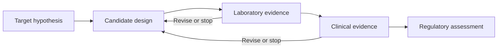

A simplified educational pipeline; stages and regulatory requirements differ by product and jurisdiction.

**Evidence:** [A generative AI-discovered TNIK inhibitor for idiopathic pulmonary fibrosis: a randomized phase 2a trial](https://www.nature.com/articles/s41591-025-03743-2)

## 8. From prediction and generation to testable mechanisms

**Window:** 14:00–16:00. **Evidence label:** Proposed framework.

**Key takeaway:** Move from prediction and generation to testable mechanistic hypotheses.

### On screen

- Repository contribution: Shengchao Liu’s Wave Intelligence perspective.
- Connect text, structures and measurements through shared representations.
- Model how a system evolves under conditions and interventions.
- Compare alternative mechanisms using observable predictions.

### Suggested spoken script

Our repository contains a perspective by Shengchao Liu called Wave Intelligence. It proposes a progression from property prediction and structure generation toward mechanistic understanding. Its framework combines shared multimodal representations, latent dynamics and decoders that map model states to observable quantities. The paper sets out a research agenda rather than demonstrating a universally validated mechanism discovery system.

This is an excellent bridge to an engineering mindset. A useful model should do more than fit what has already happened. We want to ask how a system will respond when we change a condition. For example, suppose two explanations both fit an observed process. Can we identify a feasible perturbation under which those explanations predict different outcomes? That experiment could be more informative than collecting additional data under unchanged conditions. This question applies to a chemical reaction, a production process or a controlled engineering system. It also makes uncertainty constructive. Instead of forcing the model to select one story prematurely, we can preserve alternative hypotheses and ask what evidence would distinguish them. The word wave in the paper evokes evolving scientific processes. It does not require the dynamics to obey a physical wave equation. The opportunity for our alumni is to combine domain constraints, measurements and computational tools so that proposed explanations become testable.

**Delivery cue:** Attribute the paper and show the prediction → generation → mechanism progression.

### Visual flow

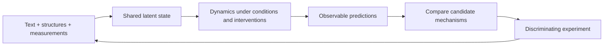

Original explanatory adaptation of Liu’s repository perspective, pp. 3–6; a research agenda, not an established validated system.

**Evidence:** [Shengchao Liu: Wave Intelligence: Toward the Next Paradigm of AI for Scientific Discovery](../wave/Wave_Intelligence.pdf)

## 9. Research agents need feedback from the world

**Window:** 16:00–17:30. **Evidence label:** Mixed evidence.

**Key takeaway:** Research agents need feedback from the real world.

### On screen

- Coscientist demonstrated tool-connected laboratory workflows.
- AlphaEvolve connects program proposals to automated evaluation.
- The evaluator determines what progress means.
- Simulation success needs an appropriate bridge to reality.

### Suggested spoken script

We already have examples of systems organized around feedback. Coscientist connected language-model planning to search, code and experimental automation in specific chemistry tasks. AlphaEvolve combines language-model program proposals with automated evaluation and evolutionary search. DeepMind published further applications in twenty twenty-six. These are examples with defined settings, not a universal guarantee of autonomous discovery.

The connection between them is the evaluator. If progress means a program runs faster, the evaluator must check both performance and correctness under relevant conditions. If progress means a better experiment, the evaluator must account for measurement quality, resource constraints and scientific relevance. A system can optimize the metric we give it while missing the outcome we wanted. This creates an important design responsibility: define the objective and the constraints together. Ask whether the environment can detect shortcuts. Ask whether a result survives a different dataset, operating condition or implementation. For an alumni community with experience across engineering and business, that combination of domain knowledge and evaluation design is a valuable place to contribute.

**Delivery cue:** Point to evaluator and acceptance gate, then transition to professional work.

### Visual flow

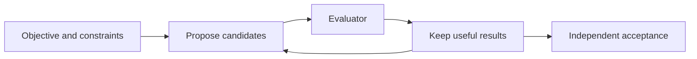

Conceptual abstraction of tool-connected discovery; simulation and physical validation can have different requirements.

**Evidence:** [Boiko et al.: Autonomous chemical research with large language models](https://www.nature.com/articles/s41586-023-06792-0), [Google DeepMind: AlphaEvolve](https://deepmind.google/blog/alphaevolve-a-gemini-powered-coding-agent-for-designing-advanced-algorithms/), [Google DeepMind: AlphaEvolve impact update](https://deepmind.google/blog/alphaevolve-impact/)

## 10. In software, measure the whole task

**Window:** 17:30–19:30. **Evidence label:** Empirical evidence.

**Key takeaway:** Measure the complete task, including review and rework.

### On screen

- AI can assist drafting, debugging, tests and code exploration.
- METR’s early-2025 experiment found 19% longer task time in its setting.
- The February 2026 follow-up identifies major measurement biases.
- Measure current tools on your own tasks, including review and rework.

### Suggested spoken script

Software engineering gives us a useful caution about measurement. In METR’s early twenty twenty-five randomized experiment, sixteen experienced developers completed two hundred and forty-six tasks in familiar open-source repositories. With the studied AI tools, completion time was nineteen percent longer. The finding concerns that setting and those tools. In its February twenty twenty-six follow-up, METR described substantial selection and timing problems in later data, making the current effect difficult to estimate precisely.

The lesson is to test the complete workflow. Generated lines of code are an input to engineering, not its final outcome. We care about whether the change meets the requirement, integrates cleanly, avoids regressions and remains maintainable. A patch that takes seconds to generate can take hours to understand. Conversely, an assistant may help someone navigate an unfamiliar system or prepare a focused change efficiently. Both possibilities deserve measurement. For a local pilot, compare similar tasks with and without assistance. Include reading, prompting, waiting, reviewing, correcting and integration. Look at defect rates as well as elapsed time. Keep the task mix visible, because an improvement on one kind of work does not establish an improvement on every kind. A thoughtful engineer should welcome useful assistance and still insist on evidence that it helps the actual job.

**Delivery cue:** Do not plot these studies as a single current capability trend or invert time changes into identical productivity percentages.

### Visual flow

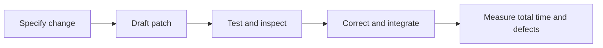

Generation time is only one component. Acceptance includes review and integration.

**Evidence:** [METR: Early-2025 experienced developer productivity experiment](https://metr.org/blog/2025-07-10-early-2025-ai-experienced-os-dev-study/), [METR: We are changing our developer productivity experiment design](https://metr.org/blog/2026-02-24-uplift-update/)

## 11. Knowledge work depends on context and quality

**Window:** 19:30–21:00. **Evidence label:** Empirical evidence.

**Key takeaway:** Gains in knowledge work depend on context and quality.

### On screen

- A support-agent study found heterogeneous productivity gains.
- Its November 2024 manuscript version reports 15% on average.
- That metric is issues resolved per hour in one work setting.
- Transfer requires access to relevant knowledge and quality checks.

### Suggested spoken script

Knowledge work also benefits unevenly. The November twenty twenty-four version of Generative AI at Work studied five thousand one hundred and seventy-two customer support agents and reported an average fifteen percent improvement in issues resolved per hour. Gains differed across workers. Earlier versions reported fourteen percent, which is why a precise citation includes the version. This result does not give a general percentage for all office work.

Consider the conditions that can make assistance useful. The task has recurring patterns. Relevant organizational knowledge is available. Outputs can be evaluated against the actual customer problem. More experienced workers may already know much of what the system offers, while someone learning the task may benefit differently. For our community, possible applications include drafting a technical explanation, searching approved documents or extracting action items from a meeting. Each needs a quality standard. A confident summary that omits a critical condition can make a decision worse. Measure whether the person can reach a correct, useful outcome with less total effort. That combines speed with comprehension and preserves the judgment that professional work requires.

**Delivery cue:** Connect support work to alumni examples without extrapolating the study’s percentage.

### Visual flow

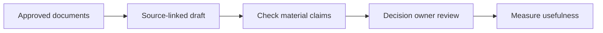

The final decision owner checks material claims and the completeness of the evidence.

**Evidence:** [Brynjolfsson, Li and Raymond: Generative AI at Work, arXiv v2](https://arxiv.org/abs/2304.11771v2)

## 12. Find the opportunity inside your discipline

**Window:** 21:00–23:00. **Evidence label:** Illustrative opportunities.

**Key takeaway:** Combine domain expertise with AI capabilities.

### On screen

- Engineering: explore alternatives; check constraints and simulation validity.
- Science: organize evidence; design discriminating experiments.
- Software: propose changes; measure integration quality.
- Leadership: redesign workflows; retain accountable owners.

### Suggested spoken script

Let us bring this back to Dalian University of Technology alumni. The examples on this slide are proposals for local pilots, rather than claims about programs already operating at our university. An engineer might use an assistant to compare design alternatives while retaining responsibility for constraints, units and validation. A scientist might use it to organize competing explanations and identify a discriminating experiment. A software professional might ask for a focused patch while using the existing test and review process. A manager might redesign how a team prepares a decision brief, with an explicit owner for every consequential statement. The most promising starting point is a task you understand well enough to evaluate.

This is why domain expertise remains useful. It lets you notice the missing assumption, choose the meaningful metric and know when a result is surprising for the wrong reason. But expertise needs a new practice alongside it: learning how to delegate bounded work to computational tools. Be explicit about the goal, input evidence, constraints, output format and acceptance test. Then inspect the result at the appropriate level. Our community can create shared learning through small, documented pilots across disciplines. A collection of well-measured experiments is more useful than a collection of impressive screenshots, because other alumni can understand where the workflow helps and where it fails.

**Delivery cue:** Use the career selector only if time permits; each option is labeled illustrative.

### Visual flow

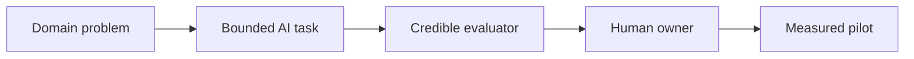

Illustrative suggestions for alumni; no claims about an existing DUT alumni program.

## 13. Build the skills that make assistance dependable

**Window:** 23:00–25:00. **Evidence label:** Recommendation.

**Key takeaway:** Learn to ask, verify, integrate and take responsibility.

### On screen

- Problem formulation and domain judgment.
- Data literacy, provenance and uncertainty.
- Evaluation, experimentation and tool integration.
- Communication, accountability and continued learning.

### Suggested spoken script

What should we learn? I would organize the answer around four complementary capabilities. First, problem formulation. Describe the outcome you want and the constraints that determine success. An unclear task remains unclear when handed to a powerful model. Second, evidence literacy. Know where the input data came from, how representative it is and what uncertainty remains. Third, evaluation and integration. Learn enough scripting, testing or experimental design to connect an output to a real check. Fourth, communication and accountability. Explain what was done, what was verified and who owns the final decision.

These capabilities suit different career stages. A student or early-career alumnus should still develop foundational knowledge and the ability to solve representative problems without assistance. Otherwise it becomes hard to detect an incorrect answer or keep learning from the task. An experienced practitioner can contribute domain constraints and challenging cases, while learning how to structure an efficient workflow. A leader can make room for experimentation and insist that quality is measured alongside time. You do not need to become an expert in every model architecture. You do need enough understanding to choose an appropriate tool, recognize its limits and test whether it helps. Over time, build a portfolio of workflows with evidence, rather than a list of tools you have tried. That portfolio makes your competence visible to collaborators.

**Delivery cue:** Choose one skill to practice next week; avoid claiming a forecast of job counts.

### Visual flow

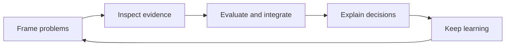

Recommended capabilities to practice together, rather than a forecast of job counts.

## 14. Match autonomy to consequences

**Window:** 25:00–26:30. **Evidence label:** Recommendation.

**Key takeaway:** Match autonomy to consequences and verification capacity.

### On screen

- Confident errors and unsupported citations.
- Sensitive data and malicious instructions in retrieved content.
- Unequal outcomes, deskilling and unclear responsibility.
- Use bounded permissions, evidence checks and accountable review.

### Suggested spoken script

The challenges become concrete when a system can act. A wrong summary may mislead a decision. A tool-connected agent may act on instructions embedded in an untrusted document. A careless workflow may expose information that the user was not authorized to share. A team may gradually lose the ability to inspect work if everyone relies on assistance without practicing the underlying skills. These are reasons to design the workflow carefully.

My recommendation is to match autonomy to consequences and verification capacity. A drafting task with public information can allow broad experimentation. An operation that changes a production system, affects a patient or releases sensitive information needs stronger controls and an accountable reviewer. Use permissions that fit the task. Keep external content as evidence to inspect, rather than treating it as authority to issue new instructions. Record meaningful actions and make stopping or reversing them possible where the process allows it. NIST’s generative AI profile offers a voluntary risk-management reference. Our concrete workflow still needs to reflect the standards and obligations of its domain. Responsible adoption can support useful experimentation by making the boundaries clear.

**Delivery cue:** Give one example: a retrieved document tells an agent to upload confidential files; the workflow must reject it.

### Visual flow

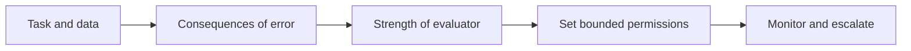

Suggested decision aid, not a numeric risk model or legal determination.

**Evidence:** [NIST: Generative Artificial Intelligence Profile, AI 600-1](https://nvlpubs.nist.gov/nistpubs/ai/NIST.AI.600-1.pdf)

## 15. Run one measured pilot in the next 30 days

**Window:** 26:30–28:00. **Evidence label:** Recommendation.

**Key takeaway:** Run a measurable, reviewable pilot within 30 days.

### On screen

- Week 1: choose a task, owner and baseline.
- Week 2: define inputs, checks and bounded access.
- Week 3: compare matched tasks and record failures.
- Week 4: decide to expand, revise or stop.

### Suggested spoken script

Here is a practical plan for the next thirty days. In the first week, choose one bounded task and record how it is done today. Name the person responsible for the pilot and define a quality standard. In the second week, prepare an approved set of inputs, write acceptance criteria and give the tool only the access it needs. In the third week, compare assisted and unassisted work on similar tasks. Record total time, quality, rework and failures. In the fourth week, review the evidence and decide whether to expand, revise or stop. Stopping a workflow that does not help is a useful result.

Use the calculator in this package as a rehearsal for that discussion. It subtracts review and correction time from an assumed gross saving. It is an illustration, not a forecast or a measured return on investment. The important move is to ask which assumptions need local data. For alumni collaboration, share sanitized examples and evaluation methods. Keep proprietary information within the appropriate boundaries. A well-documented pilot can help another alumnus understand the conditions for success and adapt the method to a different field.

**Delivery cue:** Allow 20–30 seconds to vary review time in the calculator; use the static example if needed.

### Visual flow

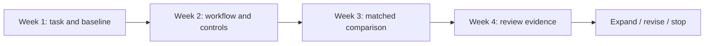

Recommended schedule. Expand, revise and stop are all legitimate outcomes.

## 16. More ideas. Stronger evidence. Human responsibility.

**Window:** 28:00–30:00. **Evidence label:** Synthesis.

**Key takeaway:** Let AI expand exploration, evidence guide action and people retain responsibility.

### On screen

- Use AI to widen the space of possibilities.
- Use evidence to decide what deserves action.
- Build your career around judgment and reliable execution.
- Panel question: which alumni problem has both value and a credible evaluator?

### Suggested spoken script

Let me close by returning to the task you had in mind at the beginning. Could AI help you explore more alternatives, organize relevant evidence or prepare a candidate solution? What would tell you whether the result is good enough? Who would take responsibility for using it? Those three questions turn a broad technological change into a practical professional experiment. The frontier is exciting because new systems can contribute to work that once seemed beyond their reach. It is also demanding because a larger supply of plausible ideas requires stronger methods for deciding which ideas deserve belief and action. For Dalian University of Technology alumni, this connects naturally to an engineering tradition: formulate the problem, understand the constraints, test the result and learn from what happens. My recommendation is to start with one useful workflow, measure it honestly and share what you learn. Let AI expand exploration. Let evidence determine action. Let people retain responsibility. Thank you. I would welcome a discussion of which problem in our alumni community has both real value and a credible way to evaluate an AI contribution.

**Delivery cue:** Use the final 45–60 seconds for one audience response or a panel handoff. The complete schedule is 30 minutes.

### Visual flow

Conceptual workflow: proposals become useful through evidence and accountable decisions.
