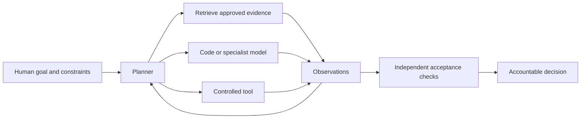
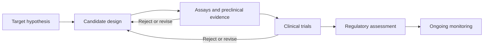

# Research brief and technical appendix

Read this document for preparation; do not try to speak the entire appendix in 30 minutes. The timed script is generated in [01-speaker-notes.md](01-speaker-notes.md). All current-event statements use a review cutoff of **2026-10-02**. Suggestions and examples are explicitly marked.

## 1. The central argument

**Speaker interpretation:** AI can increase the number and diversity of candidate explanations, designs and analyses we can explore. The resulting value depends on the question, relevant data, evaluation and integration into a real decision. A good interface makes uncertainty and provenance visible. Human expertise contributes the acceptance standard as well as the initial question.

This argument does not require assuming consciousness, human-like thought, imminent universal job replacement or a guaranteed rate of future progress. Discuss observable behavior: tasks performed, tools used, checks applied and results reproduced.

## 2. Vocabulary without mystification

| Term | Working explanation | Boundary to preserve |
| --- | --- | --- |
| LLM | A model trained to generate outputs conditioned on input, often using a language token interface | Fluent output can contain false statements |
| Reasoning workflow | Additional computation spent exploring steps or alternatives | A longer explanation is not a correctness certificate |
| Agent | A model-driven loop with tools, observations, state and a stopping policy | Agent is a system design, not a guarantee of autonomy or intelligence |
| Retrieval | Bring relevant source material into the model’s context | Retrieved text may be wrong, outdated or malicious |
| Specialized scientific model | A model built for a scientific prediction or design task | Scientific AI is broader than general LLMs |
| Formal proof checking | A logical checker validates an expressed theorem under its foundations and assumptions | Audit the theorem and its correspondence to the intended claim |
| Reproducibility | Others can repeat a specified analysis or procedure | Repeating a biased experiment can reproduce a biased result |
| Mechanistic hypothesis | A proposed account of interactions or transformations producing observable behavior | Multiple mechanisms may fit the same observations |

**Conceptual architecture:**



Grounded examples of tool-connected systems are [Coscientist](https://www.nature.com/articles/s41586-023-06792-0) and [AlphaEvolve](https://deepmind.google/blog/alphaevolve-a-gemini-powered-coding-agent-for-designing-advanced-algorithms/). The architecture above is an explanatory synthesis, not a reconstruction of either system.

## 3. Navier–Stokes: what the formulation says

For an incompressible fluid, a common nondimensional or normalized notation is:

```text
∂ₜu + (u · ∇)u = −∇p + νΔu + f
∇ · u = 0
```

Here `u(x,t)` is velocity, `p(x,t)` is the pressure variable in the chosen normalization, `ν > 0` is kinematic viscosity and `f(x,t)` is an applied force per the formulation. Incompressibility constrains divergence. Boundary conditions, the spatial domain, forcing, regularity and initial data are part of the question; the equation alone is insufficient.

[Fefferman’s official Clay description](https://www.claymath.org/wp-content/uploads/2022/06/navierstokes.pdf) offers alternatives A/B for existence and smoothness under specified conditions and C/D for breakdown with specified smooth data and forcing, on whole space or a periodic domain. Preserve the precise alternative when communicating a result. A forced statement and an unforced statement are different mathematical questions.

[The OpenAI manuscript, Theorem 1.1](https://cdn.openai.com/pdf/32d9f210-8b73-45e0-91bc-82a30aef8a9a/navier-stokes.pdf), states a construction for every positive viscosity, with smooth forcing compactly supported in space and time, zero initial velocity and finite energy while velocity becomes unbounded in finite time. This is an author-stated theorem; this presentation package has not independently established its validity.

### What was checked for this package

- The official announcement, opening theorem of the linked manuscript and proof repository README were read.
- The distinction between forced and unforced formulations was checked against the official problem description.
- The Clay overview displayed **Active** at review time. This is a page status, not a comprehensive survey of mathematical opinion.
- No Lean build, axiom audit, independent review of the full analytical proof or certification of general acceptance was performed.

[Clay’s rules](https://www.claymath.org/millennium-problems/rules/) separately require qualifying publication, at least two years after publication and general mathematical acceptance before consideration. A proposed result can be scientifically interesting before any prize process is complete.

### Why a singularity does not mean “all CFD is broken”

**Mathematical interpretation:** a blowup claim concerns a specified continuum model, data and evolution. It does not make a literal prediction of infinite speed in a real fluid, nor automatically invalidate a numerical calculation in a bounded operating regime. Computational fluid dynamics also depends on discretization, boundary conditions, constitutive assumptions and validation against relevant physical observations. Industrial usefulness and a global mathematical theorem answer different questions.

### What to inspect in a formalization

1. Does the statement use the intended domain, regularity, force and energy condition?
2. Do definitions encode the mathematical objects as intended?
3. Are placeholders or unproved assertions present? Which axioms and dependencies are used?
4. Can an independent checker reproduce the result with the recorded toolchain?
5. Does the formal theorem correspond to the paper’s central claim?
6. Are claims of originality, scope and acceptance assessed separately?

The [published Lean repository](https://github.com/openai/NavierStokesAndEuler) gives build instructions and a route to Comparator checking. Those instructions are useful next steps for a specialist; their existence is not evidence that this package ran them.

## 4. Molecular science and drugs: four different questions

Structure asks what geometry is plausible. Function asks what a system does in a measured setting. Mechanism asks what process produces an observation. Clinical benefit asks whether an intervention helps people under relevant conditions. A conclusion at one level does not automatically transfer to another.

[AlphaFold 3’s paper](https://www.nature.com/articles/s41586-024-07487-w) reports prediction of biomolecular complex structures. It illustrates specialized scientific AI. The talk does not claim that a chatbot solved protein biology, that every prediction is accurate or that structure alone determines a patient outcome.

[The rentosertib phase 2a paper](https://www.nature.com/articles/s41591-025-03743-2) is a useful clinical example of generative-AI-supported discovery reaching a trial. The study involved 71 patients and 12 weeks, with safety and tolerability as its primary objective. It does not by itself establish broad efficacy, long-term safety, approval or the overall success rate of AI-designed drugs. Full text access failed during research; indexed primary-source passages were used for these narrow facts. Avoid adding subgroup efficacy numbers without checking the complete article and current clinical status.

**Illustrative evidence pipeline:**



This simplified diagram is educational. It does not prescribe a clinical protocol or enumerate every regulatory requirement. AI can assist several boxes; it does not remove evidence gates.

## 5. Research agents and algorithm search

[Coscientist](https://www.nature.com/articles/s41586-023-06792-0) demonstrated LLM planning connected to search, code execution and experimental automation for defined chemistry tasks. Its findings support discussion of tool-connected research within those settings. They do not establish an autonomous scientist capable of every discipline or unrestricted laboratory deployment.

[AlphaEvolve’s 2025 report](https://deepmind.google/blog/alphaevolve-a-gemini-powered-coding-agent-for-designing-advanced-algorithms/) describes program generation combined with automated evaluation and evolutionary selection. [The May 2026 update](https://deepmind.google/blog/alphaevolve-impact/) reports further applications. Treat performance and deployment details as author reports unless supported by independent evidence. This package intentionally avoids a catalog of spectacular percentages that would require individual baseline and methodology review.

**Design lesson:** optimization is trustworthy only to the extent that the evaluator measures the intended objective and enforces relevant constraints. A program may satisfy an incomplete test suite while violating an unstated requirement. A simulator may reward an artifact that is infeasible in the physical system. Holdout conditions, adversarial cases, physical constraints and independent review help reveal such failures.

## 6. Productivity: keep version, metric and population visible

| Study | Result used in this talk | Population and metric | What it does not establish |
| --- | --- | --- | --- |
| METR early-2025 experiment | 19% longer completion time | 16 developers; 246 tasks in familiar open-source repositories | The effect on every developer or current tools |
| METR February 2026 follow-up | Strong selection and timing limitations make a current estimate unreliable | Later experiment with changed participation and task selection | A clean universal reversal or precise current speedup |
| Generative AI at Work v2, November 2024 | 15% average improvement | 5,172 support agents; issues resolved per hour | All knowledge workers gain 15% or all groups benefit equally |

Sources: [METR 2025](https://metr.org/blog/2025-07-10-early-2025-ai-experienced-os-dev-study/), [METR 2026](https://metr.org/blog/2026-02-24-uplift-update/), [Generative AI at Work v2](https://arxiv.org/abs/2304.11771v2).

**Version discipline:** earlier support-study versions report approximately 14%; the cited v2 reports 15%. Use the version and denominator together. Do not treat an increase in task time as an equal-sized decrease in throughput: if time becomes `1.19T`, throughput becomes `1/1.19` of the baseline, assuming the same work and no other changes. Different studies’ effects should not be placed on a common bar chart as though their task definitions were interchangeable.

**Speaker interpretation:** positive and negative findings motivate local measurement. They do not justify the claim that AI always helps or always hurts.

## 7. Uncertainty and responsible adoption

The [NIST Generative AI Profile](https://nvlpubs.nist.gov/nistpubs/ai/NIST.AI.600-1.pdf) is voluntary cross-sector risk-management guidance. It supports a vocabulary for governance, measurement and management. It is not a legal checklist or a substitute for standards in engineering, medicine, employment or education.

The operational checklist in the alumni playbook is a recommendation. It maps risks to actual workflow choices: approved inputs, explicit acceptance criteria, scoped tool access, named reviewers, failure records and escalation. Avoid treating a model’s expression of confidence as a calibrated error probability unless calibration was measured for the relevant task.

## 8. Future opportunities: scenarios rather than forecasts

Possible directions include better scientific literature interfaces, more effective candidate search, assistants connected to experiment planning, stronger code verification and tools that preserve competing hypotheses. These are scenarios. The package does not attach fabricated probabilities, job-loss estimates, launch dates or guaranteed capabilities to them.

The practical question for the alumni panel is: **which valuable problem can we evaluate credibly, with data and permissions we actually have?** That question remains useful across changes in model capability.
