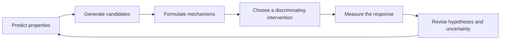
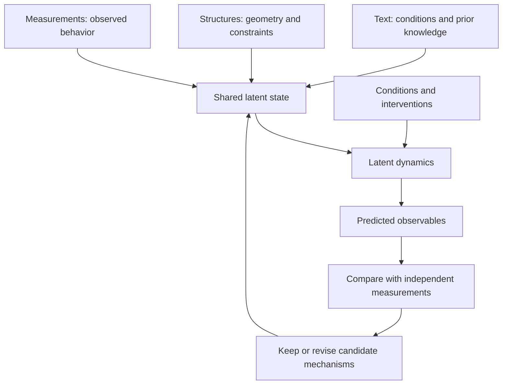

# Integrating the repository’s Wave Intelligence perspective

**Repository source:** [Wave_Intelligence.pdf](../wave/Wave_Intelligence.pdf), 8 pages, titled *Wave Intelligence: Toward the Next Paradigm of AI for Scientific Discovery*, by **Shengchao Liu**, with affiliation stated as Wave Intelligence Lab, The Chinese University of Hong Kong. No date or publication status is asserted for this repository copy. The talk uses the paper as a perspective and research agenda.

## What comes from the source

The paper motivates a progression from property prediction through structure generation toward testable mechanistic understanding (pp. 1–3). It proposes shared multimodal representations, latent evolution under conditions and interventions, and mappings back to observable quantities (pp. 3–5). Its evaluation agenda distinguishes predictive adequacy, interventional adequacy, scientific consistency and evidence for mechanistic identification (p. 6). It explicitly preserves uncertainty when several explanations fit the data and does not require a literal physical wave equation (pp. 3, 6–7).

## What this presentation adds

The talk connects that research agenda to alumni practices: identify a useful perturbation, preserve competing explanations, specify a measurable outcome and choose an accountable reviewer. The engineering analogy, illustrative calculator, pilot schedule and career examples are original presentation material. They are not empirical results from the paper or descriptions of a deployed Wave Intelligence product.

## Three scientific objectives

| Objective | Example question | Typical output | Additional evidence needed |
| --- | --- | --- | --- |
| Prediction | Which candidate has a desired property? | Estimated score or property | Held-out validation and uncertainty |
| Generation | Which structure might meet a design goal? | Candidate molecular or structural design | Feasibility, constraints and measured performance |
| Mechanistic inquiry | Which process explains observations and responses to change? | Competing dynamical hypotheses | Interventions, identifiability and independent observations |

Progression is a conceptual organization, not an assertion that these tasks occur in a rigid historical sequence. A predictive model can remain highly valuable even if it does not establish a mechanism.



## The proposed computational framework

An explanatory notation adapted from the manuscript is:

```text
z_t       = encoder(available observations, conditions)
z_(t+Δt)  = dynamics(z_t, intervention or operating conditions)
x̂_(t+Δt) = decoder(z_(t+Δt))
```

`z` represents a latent state. Text, geometry and measurements constrain it. Dynamics predict its evolution. The decoder makes consequences observable, so that data can confront the hypothesis. Missing modalities and noisy observations may require distributions over states rather than a single state estimate.



## An audience-friendly example

**Illustrative example; no actual experiment or performance claim:** two proposed explanations both fit a measured process at its normal operating point. Under explanation A, changing an input should alter the response timing substantially. Under explanation B, timing should remain nearly unchanged. An appropriate safe experiment could help distinguish them. The intervention must be chosen using domain expertise and the measurement must have sufficient resolution.

The interactive site shows two **synthetic curves** to explain this idea. The curves are simple analytic functions selected for teaching; they are neither predictions from the source paper nor real chemical kinetics. Agreement with either curve does not establish a scientific mechanism. This distinction appears next to the visualization.

## Why latent explanations can be ambiguous

Several models can reproduce the same measurements. Furthermore, a transformed latent coordinate system, paired with transformed dynamics and decoders, can preserve observable outputs. A coordinate inside a model therefore should not automatically be named after a unique physical cause. Mechanistic interpretation needs additional assumptions and evidence. This is one reason intervention tests and domain constraints matter.

## Suggested evaluation plan

1. Define the hypotheses and the observable quantities each predicts.
2. Record relevant physical constraints, missing variables and measurement noise.
3. Separate training conditions from held-out conditions and interventions.
4. Compare predictive error over multiple time steps and modalities.
5. Examine whether hypotheses disagree under feasible perturbations.
6. Test predicted responses using independent observations.
7. Preserve unresolved alternatives and document what would distinguish them.
8. Compare joint representation-and-dynamics learning with suitable separate-component baselines, using comparable data and capacity.

This is a preparation exercise inspired by the perspective, not evidence that the proposed framework has met these criteria.

## Attribution and repository handling

The original PDF is preserved unchanged. `wave/README.md` and `claude_research/prompts.md` were empty at the start of preparation. No content has been invented and attributed to either file. The public website artifact does not include the original PDF by default: it contains an attributed summary and explains that the original is in the repository. The PDF’s redistribution rights are not inferred from its presence in a private repository. A maintainer can choose to publish it after confirming permission.
