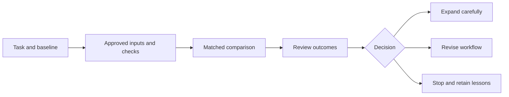

# Alumni playbook: turn the talk into a measured pilot

All examples and thresholds in this document are recommendations to adapt, not evidence of existing DUT alumni programs or established returns.

## Start with a task you can evaluate

| Alumni field | Bounded first task | Verification | Accountable owner | Useful outcome metric |
| --- | --- | --- | --- | --- |
| Engineering and manufacturing | Compare alternatives from approved specifications | Units, constraints, load cases, trusted simulation or test | Qualified engineer | Accepted alternatives per hour including checking |
| Scientific research | Organize hypotheses and a discriminating experiment | Citation accuracy, feasibility, independent observations | Researcher | Useful hypotheses tested per unit resource |
| Software and data | Draft a focused patch for a documented issue | Requirements, tests, security, integration | Maintainer | Time to accepted change and defects |
| Business and leadership | Prepare a source-linked decision brief | Material claims, assumptions, completeness | Decision owner | Preparation time, correction burden and a quality rubric |
| Education and early career | Practice a concept and critique a solution | Solve a fresh problem unaided | Learner and educator | Independent transfer performance |

## A practical task specification

Write a one-page task contract before using an agent:

- **Outcome:** what useful result will be delivered?
- **Evidence:** which approved sources, datasets or files may be used?
- **Scope:** which systems and tools may the assistant access?
- **Constraints:** what conditions must every valid answer meet?
- **Output:** what format will make review efficient?
- **Acceptance:** which checks can reject the result?
- **Owner:** who reviews and accepts the final work?
- **Stopping rule:** when should the assistant stop and escalate?
- **Failure record:** how will mistakes and rejected candidates be preserved?

Example: “Prepare a comparison of three material choices from these approved specifications. Link each numerical claim to its source. Preserve temperature and loading assumptions. Flag unavailable properties. Do not select a production material. The engineering owner will inspect units and compare the result with an existing calculation.”

## A 30-day plan

| Week | Work | Reviewable artifact | Decision |
| --- | --- | --- | --- |
| 1 | Choose a repetitive but meaningful task and record baseline effort | Task contract, baseline examples and rubric | Is the task bounded and valuable? |
| 2 | Assemble approved inputs and checks; rehearse tool failures | Workflow diagram, reviewer assignment and fallback | Can failures be detected and contained? |
| 3 | Compare assisted and baseline work on comparable tasks | Task-level time, quality and failure log | Does assistance help this task mix? |
| 4 | Review results and limitations | Short report with expansion, revision or stop decision | What evidence supports the next step? |



## Measure net effort, quality and risk

For an illustrative calculator, define:

```text
B = baseline minutes per task
s = assumed fraction of baseline saved by drafting assistance
R = review minutes
C = correction minutes
V = task volume per week

Assisted time/task = B × (1 − s) + R + C
Net minutes/task   = B − Assisted time/task
Net hours/week     = V × Net minutes/task / 60
```

If `B = 60`, `s = 0.40`, `R = 10`, `C = 5` and `V = 10`, assisted work takes 51 minutes/task and net savings are 1.5 hours/week. If review rises to 25 minutes with everything else unchanged, assisted work takes 66 minutes/task and costs an extra hour/week. These are selected assumptions, not empirical findings. The site uses this calculation without calling it a productivity forecast.

For a real pilot, add setup, training, waiting, integration, coordination, monetary costs and post-delivery failures where relevant. A mean alone can hide a few severe failures. Inspect distributions and task categories. Do not accept lower quality simply because the tool generated an answer faster.

## A task-level log template

| Task ID | Category | Condition | Baseline comparability | Total minutes | Quality score | Reviewer corrections | Failure or incident | Accepted? |
| --- | --- | --- | --- | --- | --- | --- | --- | --- |
| Example only | Specification comparison | AI assisted | Similar complexity to baseline | Record measured value | Use a prewritten rubric | Record count and significance | Retain rejected result | Reviewer decision |

Where practical, randomize assignment and avoid choosing only tasks the assistant is likely to handle well. If a randomized pilot is impractical, disclose the limitation and compare matched tasks transparently. Small pilots supply local evidence; they rarely support broad causal claims about all workers.

## Risk-to-control mapping

| Failure mode | Workflow control | Practical verification |
| --- | --- | --- |
| Unsupported or false statement | Source-linked outputs and material-claim review | Open the source and check the relevant claim |
| Citation fabrication | Approved bibliography and unresolved-source labels | Verify title, identifier and supporting passage |
| Incorrect calculation | Explicit assumptions, units and independent computation | Recompute a representative case and boundary cases |
| Sensitive data exposure | Approved inputs and scoped access | Inspect what data leaves the environment |
| Prompt injection in retrieved content | Treat external text as data and restrict tool authority | Test malicious instructions inside a sample document |
| Invalid code or workflow action | Meaningful tests, review and reversible execution | Use a staging or sandbox environment where suitable |
| Unfair or unequal outcomes | Representative evaluation and human appeal | Compare quality across relevant groups with domain guidance |
| Deskilling | Independent practice and comprehension checks | Solve a new problem without assistance |
| Responsibility gap | Named owner and decision log | Make approval and escalation explicit |

These are operational recommendations informed by [NIST’s generative AI guidance](https://nvlpubs.nist.gov/nistpubs/ai/NIST.AI.600-1.pdf). Domain-specific obligations still apply.

## Skills by career stage

**Early career:** build fundamentals, use AI to obtain feedback, verify explanations and practice unaided transfer. Keep examples of your reasoning, tests and corrections.

**Experienced practitioner:** teach the workflow its constraints, assemble difficult cases, improve the evaluator and measure total effort. Document when your domain knowledge changed the answer.

**Leader or entrepreneur:** choose outcomes that matter, preserve accountability, budget for verification and scale only after evidence. Avoid buying an impressive demonstration without a credible evaluation plan.

## An optional alumni collaboration proposal

Create a voluntary community of practice around sanitized task examples and evaluation methods. Each participant contributes a problem, baseline, acceptance rubric, measured outcome and failure lesson. Match domain experts with colleagues who can help connect tools to checks. This is a suggested activity, not a program that this package has established or launched. Invitations and communications remain the organizer’s responsibility.
