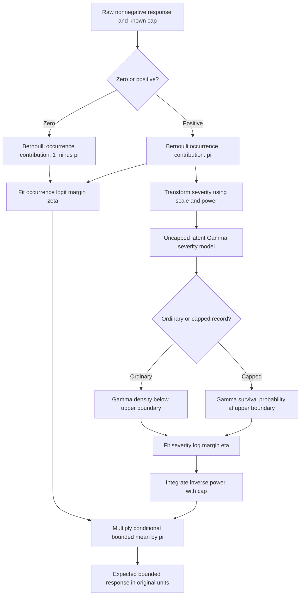
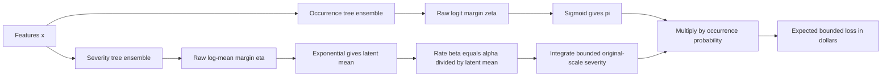

# Latent-space Zero-Inflated Gamma: explanation, equation audit and XGBoost implementation

**Paper:** *A Latent-Space Statistical Learning Framework for Semicontinuous Outcomes: Regularized Deviance and Boundary-Stabilized Optimization*. **Author:** Jianping Philip Wang. **Affiliation stated in the paper:** Acuity, A Mutual Insurance Company, Actuarial and Strategic Analytics. **Reference examined:** [arXiv:2608.26286v2](https://arxiv.org/abs/2608.26286v2), category stat.ME, 16 pages, one figure. The first submission was August 26, 2026; version 2 was submitted September 30, 2026. The manuscript’s title page retains an August 7, 2026 date. This document audits the September 30 version, not an assumed journal publication. **Analysis date:** October 3, 2026.

**Companion program:** `latent_space_zig_xgboost.py`. This is an independently written, runnable educational implementation, not the author’s released code. It includes executable numerical checks and four synthetic-data comparators. It implements the valid censored likelihood and explicitly corrects problematic profiling and deviance claims described below.

**Read this distinction first:** the occurrence/severity likelihood, margin derivatives and bounded expectation can be checked mathematically. They do not establish superiority over existing production systems. Moreover, the paper’s boundary “saturated” reference in Equation (18), the nonnegativity interpretation of Equation (21), and the censored null-mean profiling identity in Equations (34)–(35) do not hold as general unconstrained-likelihood statements. This reference derives counterexamples rather than silently reproducing those claims.

## Table of contents

1. [Paper overview](#1-paper-overview)
2. [What latent space means here](#2-what-latent-space-means-here)
3. [Statistical architecture and likelihood](#3-statistical-architecture-and-likelihood)
4. [Comparison with compound Poisson-Gamma Tweedie](#4-comparison-with-compound-poisson-gamma-tweedie)
5. [What XGBoost Tweedie changes](#5-what-xgboost-tweedie-changes)
6. [What conventional hurdle models already provide](#6-what-conventional-hurdle-models-already-provide)
7. [Censoring, truncation and capping](#7-censoring-truncation-and-capping)
8. [Occurrence gradient and Hessian](#8-occurrence-gradient-and-hessian)
9. [Ordinary severity gradient and Hessian](#9-ordinary-severity-gradient-and-hessian)
10. [Boundary gradient and Hessian](#10-boundary-gradient-and-hessian)
11. [Boundary stabilization and its limits](#11-boundary-stabilization-and-its-limits)
12. [Hessian structure and orthogonality](#12-hessian-structure-and-orthogonality)
13. [How XGBoost uses these derivatives](#13-how-xgboost-uses-these-derivatives)
14. [Two raw prediction margins](#14-two-raw-prediction-margins)
15. [The original-scale bounded expectation](#15-the-original-scale-bounded-expectation)
16. [Structural parameter estimation and corrections](#16-structural-parameter-estimation-and-corrections)
17. [Complete worked insurance example](#17-complete-worked-insurance-example)
18. [Executable implementation and numerical safeguards](#18-executable-implementation-and-numerical-safeguards)
19. [Comparison experiment and actual results](#19-comparison-experiment-and-actual-results)
20. [Critical analysis, limitations and open questions](#20-critical-analysis-limitations-and-open-questions)
21. [Terminology glossary](#21-terminology-glossary)
22. [Equation audit and verification record](#22-equation-audit-and-verification-record)
23. [Use this example to open the alumni presentation](#23-use-this-example-to-open-the-alumni-presentation)
24. [Key Takeaways](#key-takeaways)

## 1. Paper overview

Imagine an insurance table with one row per exposure: many policyholders have no claim, most claim amounts are modest, and a few losses are enormous. A zero is a real outcome rather than a missing measurement. Positive amounts occupy a continuous range. A policy limit or an operational reporting limit may hide how large the largest losses actually were.

The modeling problem has three parts: whether a positive outcome occurs, its size when it occurs, and what an upper-limit observation tells us. A single average-loss prediction does not automatically answer all three questions.

The paper’s central idea is to retain an independent event-occurrence model, compress positive amounts into a scaled power coordinate, fit a Gamma severity model in that coordinate, and treat capped observations as survival events. It supplies analytic first and second derivatives suitable for Newton updates and boosting. Returning predictions to dollars requires integrating the inverse transformation, including the mass accumulated at the cap.

A plain-English summary is: **learn whether there is a loss; learn a distribution for its transformed size; interpret “at the cap” as “at least the cap”; then calculate the expected bounded dollar amount.**

Exact zeros and highly skewed positive outcomes cause different difficulties. A density on positive values cannot allocate a discrete probability to zero. A small number of large values can dominate variance and aggregate loss. Extreme severity uncertainty makes individual realized losses difficult to predict even when the conditional mean is estimated well. Administrative capping also changes the information in the observation. Those are statistical issues, not problems solved simply by using deeper trees.

Applications include insurance pure premium, medical spending, operational losses and other event-plus-positive-amount settings. Here occurrence means a binary positive/zero outcome. It is not automatically an actuarial claim-count frequency model: an exposure with three claims still has occurrence indicator one. Exposure offsets, multiple claims per policy and varying policy limits require extensions.

## 2. What latent space means here

### A transformed response coordinate, not a learned embedding

In deep learning, “latent space” often means a learned, usually multidimensional representation of images, language or other inputs. Here it means a **one-dimensional deterministic coordinate for the response amount**. There is no encoder neural network and no learned semantic embedding.

The paper’s Equation (1) defines the observed transformed outcome:

$$
y^* = \min\left[\left(\frac{y}{s}\right)^\lambda,U^*\right],\qquad
U^*=\left(\frac{U}{s}\right)^\lambda,\qquad 0<\lambda<1.
$$

| Symbol | Meaning | Role and units |
| --- | --- | --- |
| $y$ | Underlying or available nonnegative response | Dollars in our example; a capped record may reveal only a lower bound for the underlying loss |
| $y^*$ | Observed scaled, transformed and capped response | Dimensionless numerical target |
| $s$ | Positive reference anchor with $0<s<U$ | Same units as $y$; $y=s$ maps to one |
| $\lambda$ | Power-transformation exponent | Dimensionless curvature parameter; distinct from XGBoost’s L2 penalty |
| $U$ | Known upper observation or reporting boundary | Dollars; a business/information boundary rather than a generic outlier-removal instruction |
| $U^*$ | The same boundary in transformed coordinates | Dimensionless; severity likelihood and derivatives use it |

Using $s=\$1,000$, $\lambda=0.25$, and $U=\$100,000$ gives $U^*=100^{0.25}=3.162278$.

| Underlying amount | $y/s$ | Uncapped power $(y/s)^{0.25}$ | Observed $y^*$ | Boundary? |
| --- | --- | --- | --- | --- |
| \$100 | 0.1 | 0.562341 | 0.562341 | No |
| \$1,000 | 1 | 1 | 1 | No |
| \$10,000 | 10 | 1.778279 | 1.778279 | No |
| \$100,000 | 100 | 3.162278 | 3.162278 | Yes, if the record represents an administrative cap |
| \$1,000,000 | 1,000 | 5.623413 | 3.162278 | Yes |

For $r=y/s>1$, $r^\lambda<r$: values above the anchor shrink relative to the normalized original coordinate. For $0<r<1$, $r^\lambda>r$: values below the anchor move upward toward one. At the anchor, $r^\lambda=1$. These are Equations (5)–(6).

“Compressed” does not mean that $y^*$ can be compared numerically with dollar amounts. It means compression relative to the dimensionless ratio $y/s$, or reduced multiplicative separation between observations. Without capping, a tenfold increase in dollars becomes a factor $10^{0.25}=1.778279$ increase in transformed size. The mapping is monotone, so it preserves ordering below the cap. Capping intentionally loses the ordering of amounts above $U$.

The positive power map is concave throughout its positive domain:

$$
h''(y)=\frac{\lambda(\lambda-1)}{s^\lambda}y^{\lambda-2}<0.
$$

Thus the paper’s phrase “convex left-body expansion” should not be read as a statement that the map becomes convex below $s$. The expansion inequality is valid; the map’s curvature remains concave. This derivative is an independent clarification.

## 3. Statistical architecture and likelihood

### Separate the unobserved severity from the capped record

To remove an ambiguity in the paper’s notation, write $T$ for the **uncapped** positive transformed severity. Conditional on occurrence:

$$
T\mid Y>0,x\sim\operatorname{Gamma}(\alpha,\beta(x)),\qquad
\mu^*(x)=\frac{\alpha}{\beta(x)}=e^{\eta(x)}.
$$

This is the shape-rate convention in Equation (9), not the shape-scale convention. The observed transformed positive record is $\min(T,U^*)$. It has continuous density below $U^*$ and a point mass at $U^*$. It is therefore not itself an ordinary, uncapped Gamma random variable.

Define occurrence and boundary indicators:

$$
d_i=\mathbf{1}(y_i>0),\qquad
\delta_i=\mathbf{1}(\text{record }i\text{ is right-censored at }U).
$$

For deterministic clipping of known raw amounts, $\delta_i=\mathbf{1}(y_i\ge U)$. In real data, use the administrative censoring flag rather than guessing from rounded transformed numbers.

Occurrence follows Equations (7)–(8) and (22):

$$
P(Y>0\mid x)=\pi(x),\qquad \zeta(x)=\operatorname{logit}\pi(x).
$$

The positive Gamma density and survival probability are:

$$
f_T(t)=\frac{\beta^\alpha}{\Gamma(\alpha)}t^{\alpha-1}e^{-\beta t},\qquad
S_T(U^*)=\frac{\Gamma(\alpha,\beta U^*)}{\Gamma(\alpha)}.
$$

The likelihood contributions are the three cases in Equation (10):

$$
\mathcal{L}_i=
\begin{cases}
1-\pi_i,&d_i=0,\\
\pi_i f_T(y_i^*),&d_i=1,\delta_i=0,\\
\pi_i S_T(U^*),&d_i=1,\delta_i=1.
\end{cases}
$$

The positive density below the cap integrates to $1-S_T(U^*)$. Consequently the two point masses and continuous body sum to one:

$$
(1-\pi)+\pi\int_0^{U^*}f_T(t)\,dt+\pi S_T(U^*)=1.
$$

This is a mixed discrete/continuous probability model. A density value is not an event probability: it can exceed one without violating normalization.



The negative log-likelihood separates into occurrence and positive severity terms, as in Equations (12)–(14). For fixed transformation parameters, the raw-scale Jacobian does not change derivatives with respect to $\eta$. It does matter when comparing different transformations; Section 16 explains why.

## 4. Comparison with compound Poisson-Gamma Tweedie

### Construction and coupling

For $1<p<2$, a compound Poisson-Gamma Tweedie variable can be represented as:

$$
Y=\sum_{j=1}^{N}C_j,\qquad N\sim\operatorname{Poisson}(\nu),
$$

with positive Gamma increments $C_j$ and a zero total when $N=0$. A standard parameterization is:

$$
\nu=\frac{\mu^{2-p}}{\phi(2-p)},\qquad
\operatorname{shape}(C_j)=\frac{2-p}{p-1},\qquad
\operatorname{scale}(C_j)=\phi(p-1)\mu^{p-1}.
$$

These auxiliary identities follow from the compound representation and give:

$$
E[Y]=\mu,\qquad \operatorname{Var}(Y)=\phi\mu^p,
$$

and the paper’s Equation (4):

$$
P(Y=0)=e^{-\nu}
=\exp\left[-\frac{\mu^{2-p}}{\phi(2-p)}\right].
$$

The same $\mu,\phi,p$ control the mean, variance, increment distribution and zero mass. You cannot independently choose any zero probability and any positive severity distribution while holding those parameters fixed.

For fixed $\mu,p$, increasing dispersion $\phi$ raises the zero probability. That directional fact supports the paper’s concern: reconciling large positive variability may interfere with occurrence calibration in a misspecified joint model. It does **not** prove that every heavy-tailed portfolio forces an unacceptable Tweedie fit. The mean and power can also change, dispersion can be modeled, and predictive mean accuracy and full distribution calibration are different targets.

### The paper’s illustrative numbers

Figure 1 reports an observed positive fraction about 60.4%, hence observed zero fraction about 39.6%, and a particular fitted Tweedie zero mass about 83.3%. The paper’s transformed hurdle fit retains the independent observed zero fraction. Those are **reported illustrative fit results**, not a universal consequence of Tweedie regression and not a benchmark reproduced by our code.

The supplied manuscript does not establish a comprehensive out-of-sample comparison of production XGBoost systems. Its discussion places extensive applied evaluation in a companion manuscript listed as “in preparation.” A marginal intercept-only illustration of zero mass is also different from calibrated conditional occurrence probabilities in a covariate-dependent portfolio.

The Tweedie unit deviance is algebraic for fixed $p$. Evaluating its full density or survival distribution is a different, more demanding calculation. The paper’s Equation (2) and discussion distinguish these tasks. Do not claim that ordinary XGBoost Tweedie training necessarily evaluates a costly infinite-series density for every tree split.

## 5. What XGBoost Tweedie changes

A classical log-link Tweedie GLM may use:

$$
\log\mu(x)=X\beta.
$$

XGBoost replaces that linear predictor with boosted trees:

$$
\log\mu(x)=f(x)=\sum_{m=1}^{M}f_m(x),
$$

while using:

```python
objective="reg:tweedie"
```

Flexible trees can learn interactions and nonlinear conditional mean patterns. They do not, by themselves, replace the objective’s underlying Tweedie mean/variance relationship with an independent occurrence-and-severity model.

There is a further practical distinction: XGBoost’s built-in objective estimates the mean predictor for a selected variance power. It does not automatically fit every full-distribution parameter needed to report a well-calibrated zero probability. In particular, turning its mean into $P(Y=0)$ requires a dispersion estimate and a justified distributional interpretation. Our program labels its validation-residual dispersion calculation as a **diagnostic**, not an XGBoost-produced classifier or a full Tweedie likelihood fit.

Predictive flexibility can mitigate problems caused by an inadequate mean specification. It cannot logically guarantee that arbitrary conditional zero masses and positive tail shapes become compatible with a constrained distribution family. Conversely, a structural criticism of the family does not invalidate its use for bounded mean prediction when its empirical performance is adequate.

Primary implementation reference: [XGBoost parameters](https://xgboost.readthedocs.io/en/stable/parameter.html).

## 6. What conventional hurdle models already provide

A conventional two-part model already separates:

$$
P(Y>0\mid x)=\pi(x),\qquad
Y\mid Y>0,x\sim\operatorname{Gamma}(\alpha,\beta(x)).
$$

For a continuous Gamma component there is no positive-component mass at exactly zero. Thus “zero-inflated Gamma,” “zero-adjusted Gamma” and “Gamma hurdle” commonly describe the same zero-plus-positive architecture in this setting. This differs from zero-inflated count models whose count component itself produces zeros.

**Separating occurrence and severity is not the paper’s new invention.** The paper itself discusses established two-part and hurdle methodology. Its proposed package combines that separation with a power-transformed response, explicit survival mass at a cap, a deviance formulation, closed-form margin derivatives and second-order optimization intended for boosting.

The paper is also too broad when it characterizes conventional hurdle models as inherently unable to handle censoring or tractable boundary derivatives. A censored Gamma hurdle model is obtained by setting the transformation to a linear scaling, $\lambda=1$, and using the same Gamma survival calculus. That is why the program includes a **censored hurdle Gamma control** in addition to a baseline that treats bounded positive records as exact.

| Model | Independent occurrence? | Positive response coordinate | Boundary treatment in our experiment |
| --- | --- | --- | --- |
| XGBoost Tweedie | No independent occurrence head | Original bounded response, scaled for conditioning | Bounded labels treated as exact outcomes |
| Ordinary hurdle Gamma | Yes | Original bounded positive response, scaled | Cap treated as exact positive amount |
| Censored hurdle Gamma | Yes | Linear scaled severity, $\lambda=1$ | Survival probability |
| Latent power-Gamma hurdle | Yes | Power-scaled severity, $0<\lambda<1$ | Survival probability |

This comparison separates the contribution of a censor-aware likelihood from the additional transformation. It does not establish that the particular combination is unprecedented across all distributional boosting research.

## 7. Censoring, truncation and capping

Suppose the reporting boundary is $U=\$100,000$ and the underlying claim is $\$250,000$. If the record is stored at the boundary, the information retained is:

$$
Y\ge\$100,000,
$$

not the exact assertion $Y=\$100,000$. A survival likelihood integrates over every compatible underlying amount:

$$
P(T\ge U^*)=\int_{U^*}^{\infty}f_T(t)\,dt.
$$

For a continuous distribution, the probability of an exact specified value is zero; ordinary exact observations use a density. A censored observation instead uses an event probability. Confusing the two changes the fitted likelihood.

| Term | What happens | Appropriate interpretation |
| --- | --- | --- |
| Right censoring | The observation remains, but its true magnitude is only known to exceed a boundary | Survival probability at that boundary |
| Upper truncation | Outcomes above a boundary are excluded from the sample altogether | Likelihood conditional on inclusion, including a normalization factor |
| Clipping/capping | A recorded value is replaced by a boundary | Creates a censored representation if only a lower bound for underlying severity is retained |
| Limited payment | The insurer actually pays $\min(Y,U)$ | A bounded outcome with genuine boundary mass; distinguish payment from underlying economic loss |

Censoring and predicting a limited payment are compatible: fit the underlying severity using the information in capped records, then calculate expected limited payment. However, if the full $\$250,000$ is available and the task is to estimate total losses, deliberately discarding that amount sacrifices information. Capping does not recover hidden tail magnitudes or make the unlimited mean identifiable from capped data without assumptions.

Varying deductibles, policy limits, inflation and reporting mechanisms need row-specific treatment. The provided program assumes one known cap and no deductible, claim development or exposure variation.

## 8. Occurrence gradient and Hessian

The Bernoulli negative log-likelihood for row $i$ is:

$$
L_{\mathrm{occ},i}=-(1-d_i)\log(1-\pi_i)-d_i\log\pi_i.
$$

With $\pi_i=\sigma(\zeta_i)$, this equals:

$$
L_{\mathrm{occ},i}=\log(1+e^{\zeta_i})-d_i\zeta_i.
$$

Use a stable `logaddexp` evaluation rather than calculating $e^{\zeta_i}$ directly for large margins. Since $d\pi_i/d\zeta_i=\pi_i(1-\pi_i)$, differentiation gives the paper’s Equations (23) and (26):

$$
g_{\zeta,i}=\pi_i-d_i,\qquad
h_{\zeta,i}=\pi_i(1-\pi_i).
$$

Here $d_i$ is observed occurrence, $\zeta_i$ is the model’s raw logit margin, and $\pi_i$ is the fitted probability. These are exactly familiar logistic-loss derivatives. They are gradients of a negative log-likelihood or half-deviance; the statistical score of the **log-likelihood** would have the opposite sign.

For $\pi=0.6$ and a positive observation $d=1$:

$$
g_\zeta=-0.4,\qquad h_\zeta=0.24,\qquad
\Delta\zeta=-g/h=1.666667.
$$

The initial margin is $\log(0.6/0.4)=0.405465$. An unregularized full step raises it to about $2.072132$, corresponding to probability about $0.8882$. A positive row therefore pushes occurrence probability upward. A zero row at the same probability has $g=0.6$, $h=0.24$, and single-row step $-2.5$.

A single-row logistic step is not the tree update for a mixed leaf, and it can become large for confident classification errors. Learning rate, aggregated curvature and regularization remain relevant.

## 9. Ordinary severity gradient and Hessian

For an ordinary positive record, $0<y_i^*<U^*$, Equation (9) gives:

$$
-\log f_T(y_i^*)=
-\alpha\log\beta_i+\log\Gamma(\alpha)
-(\alpha-1)\log y_i^*+\beta_i y_i^*.
$$

Using $\beta_i=\alpha e^{-\eta_i}$ and holding $\alpha$ fixed, the terms that depend on $\eta_i$ are:

$$
L_{\mathrm{sev},i}=\alpha\eta_i+\alpha y_i^*e^{-\eta_i}+\text{constant}.
$$

Therefore the ordinary parts of Equations (25) and (27) are:

$$
g_{\eta,i}=\alpha\left(1-\frac{y_i^*}{\mu_i^*}\right),\qquad
h_{\eta,i}=\alpha\frac{y_i^*}{\mu_i^*},\qquad \mu_i^*=e^{\eta_i}.
$$

Every symbol has a specific role: $y_i^*$ is the observed transformed amount, $\mu_i^*$ is the **uncapped Gamma mean** in that coordinate, $\eta_i$ is its log margin, and $\alpha$ is the fixed Gamma shape.

For $\alpha=8$, $y^*=2$, $\mu^*=1$:

$$
g_\eta=8(1-2)=-8,\qquad h_\eta=8(2)=16,\qquad
\Delta\eta=\frac{8}{16}=0.5.
$$

The full Newton step changes the mean from one to $e^{0.5}=1.648721$, moving toward two. It does not jump directly to the exact optimum $\eta=\log 2$ because Newton’s method uses a local quadratic approximation.

Zero observations supply **no severity likelihood contribution**. Their severity gradient and Hessian are both zero. Substituting $y^*=0$ into the ordinary Gamma formula would incorrectly assign them a severity gradient $\alpha$.

## 10. Boundary gradient and Hessian

For a capped record, define:

$$
z=\beta U^*=\frac{\alpha U^*}{\mu^*},\qquad
R(\alpha,z)=\frac{z^\alpha e^{-z}}{\Gamma(\alpha,z)}.
$$

The upper incomplete Gamma function is:

$$
\Gamma(\alpha,z)=\int_z^{\infty}t^{\alpha-1}e^{-t}\,dt.
$$

Dividing by $\Gamma(\alpha)$ makes it a unit-rate Gamma tail probability. The lower incomplete Gamma function is instead:

$$
\gamma(\alpha,z)=\int_0^z t^{\alpha-1}e^{-t}\,dt.
$$

They satisfy $\gamma(\alpha,z)+\Gamma(\alpha,z)=\Gamma(\alpha)$. The paper uses upper incomplete Gamma survival expressions in its operative equations, even where surrounding prose mentions a lower incomplete Gamma function.

The boundary loss is:

$$
L_b=-\log S_T(U^*)=-\log\Gamma(\alpha,z)+\log\Gamma(\alpha).
$$

Because $dz/d\eta=-z$ and $\partial\Gamma(\alpha,z)/\partial z=-z^{\alpha-1}e^{-z}$:

$$
g_\eta=-R(\alpha,z).
$$

This is Equation (24) and the boundary term of Equation (25). To differentiate again, first calculate:

$$
\frac{d\log R}{dz}=\frac{\alpha}{z}-1+\frac{R}{z},\qquad
\frac{dR}{dz}=\frac{R}{z}(\alpha-z+R).
$$

Applying $dz/d\eta=-z$ to $g=-R$ gives the boundary part of Equation (27):

$$
h_\eta=R(\alpha,z)[\alpha-z+R(\alpha,z)].
$$

A cap observation always has a negative severity gradient for finite positive parameters: increasing the underlying mean makes the observed tail event less surprising. It is not an exact observation that demands fitting the mean to the cap.

With $\alpha=8$, $U^*=3.162278$, and $\mu^*=1$, the program obtains:

$$
z=25.298221,\quad -\log S=10.902519,\quad
R=18.634401,\quad g=-18.634401,\quad h=24.898900.
$$

The single-row Newton step is about $0.7484$. The $+1$ result is a deep-tail asymptotic statement, not a universal boundary update.

## 11. Boundary stabilization and its limits

For fixed $\alpha$ and $z\rightarrow\infty$, the paper’s Equation (29) uses:

$$
\Gamma(\alpha,z)=z^{\alpha-1}e^{-z}
\left[1+\frac{\alpha-1}{z}+O(z^{-2})\right].
$$

Thus Equation (30) gives:

$$
R(\alpha,z)=z-(\alpha-1)+O(z^{-1}).
$$

Retaining the constant term matters. If one prematurely replaces $R$ by $z$ inside $\alpha-z+R$, one gets the wrong leading coefficient for the Hessian. The correct calculation is:

$$
\alpha-z+R=1+O(z^{-1}),
$$

so Equations (32)–(33) imply:

$$
g_\eta\sim-z,\qquad h_\eta\sim z,\qquad
\Delta\eta=-\frac{g_\eta}{h_\eta}\rightarrow1.
$$

Since $\eta=\log\mu^*$, an unshrunk full single-row step of one multiplies the latent mean by $e\approx2.71828$. With boosting learning rate $\nu$, a leaf update near one multiplies it approximately by $e^\nu$, not necessarily by $e$.

Intuitively, a severely underestimated censored loss creates both a large push upward and large local curvature. Their ratio remains controlled in that regime. The point remains influential, rather than disappearing because a survival probability numerically underflowed.

There are important limits to this interpretation:

- The gradient and Hessian themselves **grow without bound** as $z\rightarrow\infty$. It is their Newton ratio that tends to one. The cap bounds the observed target, not every numerical argument or aggregate score.
- At the opposite limit, $z\rightarrow0$, $R\sim z^\alpha/\Gamma(\alpha)$ and $h\sim\alpha R$. The single-row ratio tends to $1/\alpha$. For small shape, a full boundary step can exceed one.
- In a tree leaf, several gradients and Hessians are summed, regularization changes the denominator, and the learning rate shrinks the result. The asymptotic single-observation statement does not fix every leaf’s weight.
- Ordinary Gamma log-link severity also has $-g/h=1-\mu^*/y^*\rightarrow1$ under severe underprediction. A bounded single-row limit is not uniquely created by this new capped architecture.
- Logistic occurrence derivatives can have very small curvature for confident errors. The severity argument is not a global guarantee for both heads.

For numerical stabilization, the implementation uses an independently derived longer expansion:

$$
R=z-(\alpha-1)+\frac{\alpha-1}{z}
+\frac{(\alpha-1)(\alpha-3)}{z^2}+O(z^{-3}),
$$

$$
h=z\frac{dR}{dz}
=z-\frac{\alpha-1}{z}
-\frac{2(\alpha-1)(\alpha-3)}{z^2}+O(z^{-3}).
$$

These are implementation approximations derived from the Gamma asymptotic series; they are not extra numbered equations copied from the paper. They avoid subtracting nearly equal huge numbers in the exact Hessian formula.

## 12. Hessian structure and orthogonality

For fixed structural parameters and disjoint occurrence and severity parameterizations:

$$
L(\zeta,\eta)=L_{\mathrm{occ}}(\zeta)+L_{\mathrm{sev}}(\eta).
$$

Consequently Equation (28) holds:

$$
\frac{\partial^2L}{\partial\zeta\partial\eta}=0,
\qquad
H=\begin{bmatrix}H_{\mathrm{occ}}&0\\0&H_{\mathrm{sev}}\end{bmatrix}.
$$

For an individual observation the margin Hessian is diagonal. For regression coefficients or tree parameters, each within-head block can be non-diagonal because parameters jointly affect many observations. Block diagonality across heads is not the same as every global parameter having an independent scalar Hessian.

Here information orthogonality means the expected cross-curvature between the disjoint occurrence and severity parameter blocks vanishes; the observed cross-margin curvature already vanishes exactly. It does not mean the data subsets, fitted predictions or their sampling errors are completely independent. Positive rows contribute to both heads. Shared feature selection, shared learned representations or joint structural-parameter fitting can introduce other dependencies.

Diagonal per-row output curvature is convenient for XGBoost’s multi-target custom-objective interface. Our implementation chooses `one_output_per_tree`: each output receives its own trees while reusing the feature matrix. It does not require a coupled vector-leaf architecture. Primary references: [custom-objective requirements](https://xgboost.readthedocs.io/en/stable/tutorials/advanced_custom_obj.html) and [multi-output support](https://xgboost.readthedocs.io/en/stable/tutorials/multioutput.html).

## 13. How XGBoost uses these derivatives

For observations assigned to one candidate leaf:

$$
G=\sum_{i\in\mathrm{leaf}}g_i,\qquad
H=\sum_{i\in\mathrm{leaf}}h_i.
$$

For a scalar leaf weight $w$ and XGBoost L2 penalty $\lambda_{\mathrm{xgb}}$, the local objective is approximately:

$$
G w+\frac12(H+\lambda_{\mathrm{xgb}})w^2.
$$

Differentiation gives:

$$
w=-\frac{G}{H+\lambda_{\mathrm{xgb}}}.
$$

This is the standard quadratic boosting leaf update, not a new statistical formula from the paper. It assumes no L1 thresholding or extra leaf constraints. With L1 regularization, $G$ is soft-thresholded. A configured `max_delta_step` can limit the leaf update, and learning rate $\nu$ scales the contribution to the ensemble. Split selection evaluates related regularized quadratic gains and is not simply a row-by-row Newton step.

Keep three similarly named quantities separate:

| Notation | Meaning | Program setting |
| --- | --- | --- |
| $\lambda$ | Response power exponent | `Structure.lam`, calibrated from training data |
| $\lambda_{\mathrm{xgb}}$ | L2 leaf regularization | XGBoost parameter `lambda` |
| $\nu$ | Boosting learning rate | XGBoost parameter `eta` |

The paper’s **severity margin** $\eta$ is a raw prediction value. XGBoost’s parameter named `eta` is the learning rate. That second naming collision also deserves attention.

The custom objective returns two arrays of shape $(n,2)$: per-row gradients and diagonal Hessian elements. Column zero is occurrence; column one is severity. The explicit censoring flags come from the original bounded observation mechanism, not a tolerance comparison on float32 transformed labels.

## 14. Two raw prediction margins

Prediction starts with two learned margins:

$$
\zeta(x),\qquad \eta(x).
$$

Use Equation (22) to decode them:

$$
\pi(x)=\frac{1}{1+e^{-\zeta(x)}},\qquad
\mu^*(x)=e^{\eta(x)},\qquad
\beta(x)=\frac{\alpha}{\mu^*(x)}.
$$



The two-margin structure provides occurrence and severity interpretation in addition to an unconditional mean. A low expected amount can arise from rare occurrence, modest conditional severity, or both. The mean alone cannot identify which explanation applies.

The program supplies two base margins at training, validation and prediction. Saving a booster without preserving the structural parameters and initial margins is insufficient for a faithful later prediction call. The exported `metrics.json` records those values alongside the saved `.ubj` boosters.

## 15. The original-scale bounded expectation

Let $q=1/\lambda$, $\beta=\alpha/\mu^*$, and $z=\beta U^*$. Conditional on occurrence, the unlimited raw severity corresponding to $T$ is $sT^q$.

Splitting the bounded expectation at $U^*$ gives:

$$
E[\min(Y,U)\mid x]
=\pi(x)\left[s\int_0^{U^*}t^q f_T(t)\,dt+U\int_{U^*}^{\infty}f_T(t)\,dt\right].
$$

Substitute $v=\beta t$ in the first integral. The result is the paper’s Equation (16):

$$
E[\min(Y,U)\mid x]
=\pi(x)\left[
\frac{s}{\beta^{1/\lambda}}
\frac{\gamma(\alpha+1/\lambda,z)}{\Gamma(\alpha)}
+U\frac{\Gamma(\alpha,z)}{\Gamma(\alpha)}
\right].
$$

The first term is the contribution below the cap. The second assigns payment $U$ to the probability that the latent severity reaches the boundary. $\Gamma(\alpha)$ is the complete Gamma function; $\gamma$ is the lower incomplete Gamma function; $\Gamma(\alpha,z)$ is the upper incomplete Gamma function.

The final term is equivalently $U[1-\gamma(\alpha,z)/\Gamma(\alpha)]$. Numerically, evaluate the survival probability directly with an upper-Gamma routine rather than subtracting a nearly-one lower CDF from one.

Simply reporting $s(\mu^*)^{1/\lambda}$ is generally wrong because expectation and a nonlinear inverse transformation do not commute:

$$
E[sT^{1/\lambda}]\ne s(E[T])^{1/\lambda}.
$$

Without a cap, the model’s conditional raw expectation would instead be:

$$
E[Y\mid Y>0,x]
=s\beta^{-1/\lambda}\frac{\Gamma(\alpha+1/\lambda)}{\Gamma(\alpha)}.
$$

This uncapped moment is an independently derived Gamma identity. The cap changes it again, so clipping the inverse of the latent mean is not a substitute for Equation (16).

For $s=1,000$, $\lambda=0.25$, $\alpha=8$, $\mu^*=1$, the unlimited conditional expectation is:

$$
1,000\frac{8\cdot9\cdot10\cdot11}{8^4}=1,933.59375.
$$

At $U=100,000$, Equation (16) gives approximately \$1,933.137424. With $\pi=0.6$, the unconditional bounded expectation is approximately **\$1,159.882454**, not \$600 from multiplying the naive inverse of the latent mean by occurrence.

An expected amount is not a prediction interval, a worst-case loss, or a guarantee about an individual claim.

## 16. Structural parameter estimation and corrections

### What the paper proposes

Section 8 proposes estimating $(s,\lambda,\alpha)$ before recursive tree construction using a coarse scan and local refinement of a latent profile deviance. Equation (34) gives empirical occurrence and positive transformed mean initializers; Equations (35)–(36) assert concentrated minimization using them. The example values $s=1,000$, $\lambda=0.1860$, $\alpha=8.78$ belong to the paper’s illustration. They are not transferable defaults for other portfolios.

Holding a coordinate frame fixed within one boosting fit is sensible. It does not prove that there is one mandatory null-model estimation procedure or that parameters can never be re-estimated between complete fits.

### Correction 1: the censored null mean is not the mean of capped observations

For uncensored Gamma data at fixed shape, maximizing the constant-mean likelihood gives the sample mean. With right censoring, the stationary equation is instead:

$$
0=\sum_{i:\delta_i=0}\alpha\left(1-\frac{y_i^*}{\mu^*}\right)
-\sum_{i:\delta_i=1}R\left(\alpha,\frac{\alpha U^*}{\mu^*}\right).
$$

This is an independent derivation by summing Equation (25). It generally does not vanish at the average of recorded capped values.

For positive latent records $[1,2]$, the second censored at $U^*=2$, with $\alpha=8$, the paper’s proposed mean is $1.5$. The summed severity gradient there is approximately **$-2.000834$**, not zero. Thus Equation (35)’s claimed inner likelihood/deviance infimum is not generally attained at Equation (34)’s censored mean.

The occurrence initializer $\hat\pi=\sum d_i/n$ remains the intercept-only Bernoulli MLE. The correction concerns severity.

### Correction 2: a boundary mean equal to the cap is not the unconstrained saturated MLE

For a single censored row, its severity probability is $S_T(U^*)$. As $\mu^*\rightarrow\infty$, $z\rightarrow0$ and $S_T(U^*)\rightarrow1$. The unrestricted saturated log-likelihood has supremum zero, approached by an infinite mean. A finite mean $\mu^*=U^*$ gives $z=\alpha$ and survival less than one.

Equation (18) therefore defines a finite **reference**, not the unrestricted saturated likelihood maximum. Equation (21)’s boundary expression,

$$
D_{b,\mathrm{paper}}=2\log\frac{\Gamma(\alpha,\alpha)}{\Gamma(\alpha,z)},
$$

can be negative. For $\alpha=8$, $U^*=2$, $\mu^*=4$, $z=4$, it is approximately **$-1.478925$**. A true saturated likelihood-ratio deviance is nonnegative.

A corrected unrestricted boundary deviance is:

$$
D_{b,\mathrm{true}}=-2\log\frac{\Gamma(\alpha,z)}{\Gamma(\alpha)}=-2\log S_T(U^*).
$$

For fixed shape, both differ by a constant independent of $\eta$, so the paper’s boundary gradient and Hessian remain correct. When shape itself is estimated, that constant depends on shape and cannot be discarded innocently in a parameter-profile criterion.

### Correction 3: compare changing transformations on a common measurement scale

For an ordinary positive raw amount, the raw density is:

$$
f_Y(y)=f_T((y/s)^\lambda)\left|\frac{d(y/s)^\lambda}{dy}\right|,
$$

where:

$$
\log J(y)=\log\lambda-\log s+(\lambda-1)\log(y/s).
$$

The raw-scale negative log-likelihood is the latent negative log density **minus** $\log J(y)$. The cap contribution is still a survival probability and has no density Jacobian. This is the ordinary change-of-variable rule, not a special paper prescription.

At fixed $s,\lambda$, the Jacobian is constant in the learned margins, so it does not alter their derivatives. Across candidate transformations it varies and is necessary for a coherent raw-likelihood comparison. Parameter-dependent saturated constants similarly complicate treating a deviance as a likelihood for structural-parameter estimation.

### Correction 4: the scale anchor is a coordinate convention

For fixed $\lambda$, change $s$ to $s'=cs$. Then transformed values and cap both scale by $c^{-\lambda}$, and a matching mean shift is:

$$
\mu^{*\prime}=c^{-\lambda}\mu^*,\qquad
\eta'=\eta-\lambda\log c.
$$

The raw probability model is unchanged when the density Jacobian is included. Thus $s$ is not separately identifiable from a freely adjustable severity intercept in this model. Its computational conditioning and the behavior of a constrained learning algorithm can matter, but freely profiling it as an independent statistical parameter does not automatically identify a unique “geometric equilibrium.” The program fixes a robust training-data anchor and verifies this invariance numerically.

### Limiting transformation behavior

As $\lambda\rightarrow1$, the mapping approaches $y/s$, and the censored power-Gamma model approaches a scaled, censored hurdle Gamma model. It does not follow that every dataset forces shape toward zero.

For fixed $y>0$ and finite $s$:

$$
(y/s)^\lambda=\exp[\lambda\log(y/s)]\rightarrow1
\quad\text{as }\lambda\rightarrow0.
$$

The zeros remain zero. Positive observations bunch near **one**, not near zero. A logarithmic limit requires the centered/rescaled expression:

$$
\frac{(y/s)^\lambda-1}{\lambda}\rightarrow\log(y/s).
$$

At fixed shape, the paper’s latent deviance with its capped-sample mean can collapse toward zero as $\lambda\rightarrow0$: all positive ratios approach one, and its boundary reference ratio also approaches one. This illustrates why minimizing a transformed, parameter-dependent deviance is not automatically a well-posed transformation-selection method.

### What the implementation does

It fixes $s$ to the median positive training amount, bounded below the cap; scans configurable $\lambda$ candidates; numerically optimizes a training-only **raw-scale censored likelihood** over log shape and a null severity log mean; and then holds that structure fixed during boosting. Shape is restricted to $[0.25,40]$ as an explicit numerical/model-selection choice. Null profiling is still a simplification: feature heterogeneity can alter the appropriate conditional distribution and favor an edge of the candidate grid. Conditional profiling or nested validation would be stronger extensions.

This procedure is a deliberate implementation correction, not a claim to reproduce Equations (34)–(36) exactly or identify a globally optimal production model.

## 17. Complete worked insurance example

Take eight hypothetical exposure-level losses:

$$
\big[0,\;0,\;0,\;100,\;1{,}000,\;10{,}000,\;40{,}000,\;250{,}000\big].
$$

Use $s=1,000$, $\lambda=0.25$, $\alpha=8$, $U=100,000$. The catastrophic amount is recorded as a capped \$100,000 with a censoring flag. Start with $\pi=0.6$ and $\mu^*=1$ for every row. These illustrative starting values are not fitted to this tiny sample.

| Underlying $y$ | Recorded bounded $y$ | $d$ | $y^*$ | $\delta$ | Occurrence NLL | Severity NLL in latent units |
| --- | --- | --- | --- | --- | --- | --- |
| 0 | 0 | 0 | 0 | 0 | 0.916291 | 0 |
| 0 | 0 | 0 | 0 | 0 | 0.916291 | 0 |
| 0 | 0 | 0 | 0 | 0 | 0.916291 | 0 |
| 100 | 100 | 1 | 0.562341 | 0 | 0.510826 | 0.417884 |
| 1,000 | 1,000 | 1 | 1 | 0 | 0.510826 | -0.110371 |
| 10,000 | 10,000 | 1 | 1.778279 | 0 | 0.510826 | 2.086340 |
| 40,000 | 40,000 | 1 | 2.514867 | 0 | 0.510826 | 5.553025 |
| 250,000 | 100,000 | 1 | 3.162278 | 1 | 0.510826 | 10.902519 |

The occurrence NLL is $-\log0.4$ for a zero and $-\log0.6$ for a positive. Ordinary severity NLL uses the Gamma density; the boundary NLL uses survival. The negative value at $y^*=1$ is legitimate because a continuous density can exceed one. The table shows latent-density NLL for fixed structural parameters; add the ordinary change-of-variable term when comparing raw-scale likelihoods across transformations.

The corresponding derivative table is:

| Row type | $g_\zeta$ | $h_\zeta$ | $g_\eta$ | $h_\eta$ |
| --- | --- | --- | --- | --- |
| Each zero | 0.600000 | 0.240000 | 0 | 0 |
| \$100 ordinary | -0.400000 | 0.240000 | 3.501269 | 4.498731 |
| \$1,000 ordinary | -0.400000 | 0.240000 | 0 | 8 |
| \$10,000 ordinary | -0.400000 | 0.240000 | -6.226235 | 14.226235 |
| \$40,000 ordinary | -0.400000 | 0.240000 | -12.118935 | 20.118935 |
| Catastrophic capped record | -0.400000 | 0.240000 | -18.634401 | 24.898900 |

If all eight rows share one occurrence leaf, $G_{\mathrm{occ}}=-0.2$ and $H_{\mathrm{occ}}=1.92$. With $\lambda_{\mathrm{xgb}}=1$, the leaf weight is $0.2/2.92=0.068493$. It moves occurrence probability slightly upward toward the sample’s positive fraction $5/8=0.625$.

For the same unsplit severity leaf, zeros contribute nothing. The sums are approximately:

$$
G_{\mathrm{sev}}=-33.478301,\qquad H_{\mathrm{sev}}=71.742801.
$$

The regularized severity leaf weight is approximately:

$$
w_{\mathrm{sev}}=\frac{33.478301}{72.742801}\approx0.460228.
$$

With learning rate $0.1$, the new severity margin is approximately $0.046023$, and the uncapped latent mean becomes approximately $e^{0.046023}=1.0471$. The bounded original-scale prediction must then be recomputed using Equation (16), alongside the updated occurrence probability. It is not the observed leaf average and not the inverse of the latent mean.

Before this update, the conditional bounded prediction is \$1,933.137424 and the unconditional prediction is \$1,159.882454. The original sample’s recorded bounded mean is \$18,887.50, so the initial toy model substantially underpredicts aggregate loss. The gradient sums correctly push both heads upward. Further splits and iterations would be needed; eight synthetic rows provide no reliable training or validation evidence.

The worked example covers the raw response, indicator, transformation, censoring flag, both losses, both gradients, both curvatures, aggregated leaf interpretation and return to dollar units.

## 18. Executable implementation and numerical safeguards

### Run the complete program

The companion file includes imports, synthetic data, deterministic train/validation/test splits, training-only structural calibration, initialization, custom two-output objective, baselines, prediction, dollar conversion, evaluation, independent numerical checks and exports.

```bash
python -m venv .venv-zig
# Linux/WSL:
source .venv-zig/bin/activate
python -m pip install -r research/latent-space-zig/requirements.txt
python latent_space_zig_xgboost.py --self-test --rows 5000 --rounds 250
```

The recorded environment is Python 3.14.4, NumPy 2.5.3, SciPy 1.18.1 and CPU XGBoost 3.4.1. The pinned requirements use the CPU package for Linux/Windows x86-64; on other platforms use the corresponding `xgboost` distribution. Core mathematics requires NumPy/SciPy/XGBoost; Matplotlib is optional for the SVG plots.

```bash
# Mathematical audit only:
python latent_space_zig_xgboost.py --tests-only

# A second synthetic regime generated from a power-Gamma family:
python latent_space_zig_xgboost.py --self-test --scenario gamma-power \
  --output research/latent-space-zig/results-gamma-power

# Choose your own structural grid rather than borrowing another dataset's lambda:
python latent_space_zig_xgboost.py --lambda-grid .1,.2,.3,.5,.7,.9
```

The optional `--cap`, `--rows`, `--rounds`, `--seed` and `--output` arguments make the demonstration configurable. This program simulates data; it is not a drop-in insurance production application or a script that automatically ingests private policy records.

### Where each mathematical component lives

| Function | Purpose |
| --- | --- |
| `transform` | Equation (1), preserving zero and applying the known cap |
| `gamma_terms` | Log survival, boundary score ratio and curvature |
| `severity_nll` | Conditional likelihood, optionally including the raw-scale Jacobian |
| `severity_derivatives` | Ordinary and boundary pieces of Equations (25), (27) |
| `joint_derivatives` | Two margin columns; zero rows have no severity contribution |
| `bounded_positive_mean` | Equation (16) before multiplication by occurrence |
| `fit_null_structure` | Corrected, training-only structural calibration |
| `train_joint` | Custom XGBoost objective, two base margins and validation stopping |
| `train_baselines` | Tweedie and ordinary hurdle fits |
| `score` | Point, occurrence, positive severity and high-loss diagnostics |
| `self_test` | Independent derivatives, integration, invariance and counterexamples |

### Stable incomplete-Gamma computation

Computing $R$ as an ordinary numerator divided by `gammaincc` is unsafe when both are extremely small. Clipping survival to an arbitrary epsilon also changes the deep-tail likelihood and can destroy its derivatives.

For moderate arguments the program uses log-domain special functions. For the upper tail it evaluates a continued fraction satisfying:

$$
\Gamma(\alpha,z)=e^{-z}z^\alpha C(\alpha,z),\qquad R=1/C,
$$

and obtains:

$$
\log Q(\alpha,z)=-z+\alpha\log z-\log\Gamma(\alpha)-\log R.
$$

This identity is derived from the definition of $R$. Very large arguments use the differentiated expansion in Section 11, avoiding catastrophic cancellation. The lower-Gamma moment term uses a log-domain power series if `gammainc` underflows. Survival is evaluated directly rather than as one minus a CDF.

Other explicit implementation choices are a tiny Hessian floor for active rows, `max_delta_step=1`, shallow CPU histogram trees, a learning rate of 0.05, early stopping, bounded shape search and fail-fast checks for nonfinite data or excessive severity margins. Zero rows retain zero severity curvature; they are not given fictitious positive severity information.

All prediction and evaluation matrices receive the same two initial raw margins. XGBoost’s default output transform is bypassed with `output_margin=True` for the custom model. The program uses the original censoring flag rather than identifying the boundary from a rounded transformed label.

### Exports and inference

The program writes `metrics.json`, `comparison.csv`, `test-predictions.csv`, saved boosters and two SVG plots. The prediction CSV is synthetic. The JSON stores structural parameters, split sizes, library versions, calibration bins, initial margins, model settings and audit results.

For a saved joint model, a subsequent prediction call must rebuild the base margins:

```python
structure = Structure(**saved_details["structure"])
initial = np.asarray(saved_details["initial_margins"], dtype=float)
dnew = xgb.DMatrix(X_new, base_margin=np.tile(initial, (len(X_new), 1)))
raw = booster.predict(
    dnew, output_margin=True,
    iteration_range=(0, saved_details["best_iteration"] + 1)
).reshape(-1, 2)
pi = expit(raw[:, 0])
bounded_mean = pi * bounded_positive_mean(raw[:, 1], structure)
```

This is an inference example using functions already fully implemented in the executable file, not a replacement for that complete program.

## 19. Comparison experiment and actual results

### Design

The default demonstration generates 5,000 observations with nonlinear feature effects, Bernoulli occurrence, lognormal positive severity and a small independent multiplicative catastrophe component. It uses the same 60% training / 20% validation / 20% test split for all models, seed `20261003`, cap \$100,000, and a maximum of 250 boosting rounds. The test set is untouched during fitting and parameter selection.

Tweedie variance power is selected from $[1.3,1.5,1.7]$ using validation error. The ordinary hurdle baseline fits Bernoulli occurrence and Gamma positive amounts while treating the bounded amounts as exact. The additional censored hurdle uses $\lambda=1$ and a survival likelihood. The proposed prototype uses a power-Gamma survival likelihood and the corrected structural calibration.

These are useful comparators, not equal-effort production hyperparameter optimizations. The ordinary hurdle occurrence model early-stops on log loss; its severity model and the joint models use relevant validation mean error. Model-specific objectives and initialization differ. A careful real benchmark would define consistent tuning budgets, multiple splits, temporal validation and confidence intervals.

### Recorded lognormal-mixture experiment

The following numbers come from the actual program run, not the paper’s Figure 1. Test-set observed mean bounded loss was **\$7,738.35**.

| Model | RMSE, dollars | MAE, dollars | Mean predicted loss | Occurrence Brier score |
| --- | --- | --- | --- | --- |
| XGBoost Tweedie | 18,828.36 | 9,808.56 | 7,485.70 | 0.427527, diagnostic only |
| Ordinary hurdle Gamma | 19,002.71 | 9,755.44 | 7,263.78 | 0.206272 |
| Censored hurdle Gamma | 18,864.31 | 9,884.26 | 7,578.71 | 0.206353 |
| Latent power-Gamma hurdle | 18,855.73 | 10,405.44 | 8,544.93 | 0.206711 |

**The latent model did not have the lowest overall RMSE or MAE in this demonstration.** Its mean was also high relative to the observed aggregate. A different metric or selected subgroup can change the comparison; that is precisely why one should report several outcomes instead of presenting a universal winner.

Observed occurrence was 0.494. The independently modeled occurrence averages were approximately 0.4968, 0.4989 and 0.4993 for ordinary hurdle, censored hurdle and latent hurdle respectively. The Tweedie occurrence average derived from its validation-residual dispersion was about 0.0646. That poor **diagnostic** does not mean XGBoost directly predicted this probability, nor does it establish that a fully estimated, tuned Tweedie distribution must have the same result. Its mean prediction remained comparatively competitive.

The conditional severity diagnostics on observed-positive test rows were:

| Model | Mean conditional bounded prediction on observed positives | Observed positive mean |
| --- | --- | --- |
| Ordinary hurdle Gamma | 14,611.97 | 15,664.68 |
| Censored hurdle Gamma | 15,244.59 | 15,664.68 |
| Latent power-Gamma hurdle | 17,189.47 | 15,664.68 |

The program reports Tweedie conditional severity as unavailable rather than pretending that a built-in mean and an approximate occurrence probability provide an exact bounded conditional expectation. Its full bounded distribution would require additional calculations.

The high-loss threshold is the training-positive 90th percentile, about \$56,694.74, fixed before inspecting test outcomes. High-loss RMSEs were about \$77,302.08, \$78,970.25, \$76,951.10 and \$75,312.31 in the same model order. On the capped subset they were about \$85,922.51, \$87,685.16, \$85,376.12 and \$83,612.30. Conditioning an error calculation on **realized** high losses selects unusually large outcomes; these errors are not a direct calibration test for a conditional-mean predictor or a proof of successful catastrophic-event classification.

The actual capped fraction was 0.027. Predicted cap-event fractions were approximately 0.01426 for the censored Gamma control and 0.02921 for the latent model. The ordinary exact-Gamma and mean-only Tweedie baselines do not return an equivalent fitted boundary-probability diagnostic here.

Training-only null calibration selected $s\approx4,882.69$, $\lambda=0.15$ and $\alpha\approx13.0053$. The exponent sits at the grid boundary; that is a reason to investigate grid sensitivity and conditional calibration, not to declare a definitive optimum.

### A second regime

A separate 5,000-row run generated positive severity from a power-Gamma family with generating exponent 0.3 and shape 5. Overall RMSEs were approximately \$14,253.64 for Tweedie, \$14,258.07 for ordinary hurdle, \$14,331.65 for censored Gamma hurdle and \$14,301.21 for latent hurdle. The latent model again was not the lowest overall-error model.

Its null profiling selected exponent 0.15 rather than recovering the generating 0.3. Feature-dependent severity means create a heterogeneous marginal mixture, so intercept-only structural calibration is not a parameter-recovery guarantee for the conditional model. This is a substantive implementation limitation.

The analytical data-generating conditional mean provides an oracle benchmark, but even that mean has nonzero realized-loss RMSE because outcomes are random. On the default test set its RMSE was about \$18,438.99. Large residual uncertainty persists even for a correctly specified conditional expectation.

Both scenarios, full metrics, per-bin occurrence calibration and SVG plots are included under `research/latent-space-zig/`. Nothing in these synthetic runs proves production superiority.

## 20. Critical analysis, limitations and open questions

### What the mathematics supports

The mixed likelihood in Equations (9)–(14) coherently represents zeros, ordinary positive values and upper-censored records. The occurrence derivatives, ordinary severity derivatives, boundary derivatives, fixed-structure cross-margin zero curvature and bounded expectation follow by direct differentiation and integration. The deep-tail Newton ratio follows from the stated Gamma asymptotic expansion.

These are mathematical properties under specified assumptions. They do not imply accurate probabilities on misspecified data, general-purpose robustness, a globally well-conditioned objective, or a globally bounded gradient.

### What the manuscript empirically demonstrates

It supplies one illustrative marginal distribution comparison and selected parameters. It does not supply the extensive applied, out-of-sample XGBoost benchmark promised for the companion manuscript. The reported 39.6% versus 83.3% zero masses should be attributed to that example, not used as a universal software performance figure.

### What needs correction or stronger justification

The boundary saturated reference does not maximize an unrestricted censored likelihood. The resulting expression can be negative. The recorded-positive sample mean is not generally the censored Gamma likelihood optimum. The exponent-zero limit maps positive amounts toward one, not zero. The freely adjustable scale anchor is statistically confounded with the severity intercept. Direct latent-deviance profiling across changing transformations is not automatically a coherent likelihood procedure.

The paper’s claims about automatically eliminating numerical blowouts are also stronger than its fixed-shape asymptotic ratio establishes. Since $z=\alpha U^*/e^\eta$, it can be enormous for a sufficiently small predicted mean even when $U^*$ itself is modest. Appropriate special-function numerics and optimization controls are still necessary.

### Transformation and cap sensitivity

Different exponents imply different positive distribution families and different inverse-moment corrections. A compressed target with attractive in-sample appearance may produce miscalibrated dollar expectations. Calibration should be checked in original units as well as in transformed coordinates. Investigate a broader exponent grid, shape constraints, anchor conditioning and covariate-aware structural profiling.

The cap should represent the business target and information mechanism. If you change it solely to improve numerical behavior, you also change the estimand and discard information. Low caps hide tail distinctions; very high caps leave fewer boundary observations and may retain severe leverage. Varying caps require row-specific $U_i$ and $U_i^*$ in both loss and prediction.

### Conventional alternatives

Compare the method with a properly censored ordinary hurdle Gamma model, lognormal or generalized Gamma severity, Tweedie with distributional dispersion modeling, quantile regression, robust point-loss objectives and distributional boosting. Huber-type losses target a different point functional and do not automatically provide censoring-aware probabilities. A model estimating multiple distributional parameters can offer flexibility at the cost of more difficult curvature, calibration and interpretation.

The power-Gamma family produces a generalized Gamma raw severity. For $0<\lambda<1$ its tail can have stretched-exponential rather than ordinary exponential decay, but it is not a general Pareto/regularly varying model and still has finite algebraic moments. A visually broad tail is not evidence that all catastrophic loss mechanisms are adequately modeled.

### Prediction intervals and calibration

For the fitted mixed bounded distribution, quantiles account for the zero atom and cap atom. A distribution with $1-\pi$ mass at zero returns zero below that quantile level; quantiles within the continuous positive body require a Gamma inverse CDF and inverse power; sufficiently high quantiles equal the cap. This mathematical construction does not prove coverage on real data. Parameter estimation, misspecification, dependence, changing portfolios and censoring all affect calibration. Intervals above the cap require additional tail assumptions and unavailable magnitude information.

### Production considerations

A real insurance implementation needs exposure units, claim-count aggregation, deductibles, limits, development, inflation, censoring flags, treatment of missingness, validation over time, grouped dependencies and economically appropriate metrics. Interpretability should distinguish occurrence, conditional bounded severity, cap probability and unlimited severity assumptions. A feature’s effect on one head is not automatically causal.

Two ensembles and structural parameters are more complex to maintain than one mean predictor. A deployable system needs versioned parameters, documented transformations, preserved base margins, reproducible inference, numerical monitoring and original-unit calibration. CPU educational code does not establish GPU kernel quality, regulatory suitability, or financial value.

### Useful next experiments

Use repeated and temporal splits; tune models with comparable budgets; report uncertainty around metric differences; calibrate occurrence and boundary probabilities; test multiple caps and exponent grids; compare conditional versus null structural profiling; and evaluate business decisions at a fixed acceptable quality level. On real data, a censored-likelihood benchmark and held-out calibration matter more than a single attractive transformed histogram.

## 21. Terminology glossary

| Term | Explanation |
| --- | --- |
| Semicontinuous response | A response with a discrete atom at zero and continuous positive outcomes |
| Point mass | Positive probability assigned to an exact value, such as zero or a cap |
| Hurdle model | A model with a separate zero/positive decision and a conditional positive distribution |
| Zero-inflated model | A mixture adding a zero-producing component; for Gamma positives, the resulting zero-plus-positive model is a hurdle architecture |
| Tweedie distribution | An exponential dispersion family; for $1<p<2$, a compound Poisson-Gamma sum with exact zeros |
| Gamma distribution | Positive distribution specified here by shape $\alpha$ and rate $\beta$ |
| Latent space | In this paper, the deterministic transformed response coordinate, not a learned embedding |
| Power transformation | A monotone map $(y/s)^\lambda$ changing response geometry |
| Right censoring | Knowing that a response is at least a boundary without observing its exact larger magnitude |
| Survival function | $S(u)=P(T\ge u)$ for a continuous severity variable |
| Incomplete Gamma function | An integral of $t^{\alpha-1}e^{-t}$ over a lower or upper portion of the positive axis |
| Regularized Gamma function | An incomplete Gamma integral divided by $\Gamma(\alpha)$; a CDF or survival probability |
| Gradient | First derivative of the optimization loss; its sign indicates a local direction of improvement |
| Hessian | Matrix of second derivatives describing local curvature |
| Newton step | Update obtained from a local quadratic loss approximation |
| Deviance | Twice the difference between a valid saturated log-likelihood and a fitted log-likelihood; its reference matters |
| Boosting | Sequentially adding weak learners to reduce an objective |
| Information orthogonality | Zero expected cross-information between specified disjoint parameter blocks |
| Raw margin | The untransformed model output before sigmoid or exponential decoding |
| Shape-rate convention | Gamma parameterization with mean $\alpha/\beta$, as opposed to shape-scale mean $\alpha\theta$ |
| Limited expected value | Expected payment $E[\min(Y,U)]$, distinct from the unlimited loss mean |

## 22. Equation audit and verification record

| Paper equation or section | Content | Audit result |
| --- | --- | --- |
| (1), (5)–(8) | Scaled power and zero preservation | Valid mapping/inequalities; map remains concave below the anchor |
| (4) | Tweedie zero probability | Valid compound-Poisson expression under the stated parameterization |
| (9)–(14) | Gamma density, cap survival and likelihood decomposition | Valid with an uncapped underlying Gamma severity and capped observed mixture |
| (15)–(16) | Bounded original-scale expectation | Verified by variable substitution and independent numerical integration |
| (17)–(18) | Saturated model and finite boundary mean | Boundary mean-at-cap is not the unrestricted censored saturated maximum |
| (20)–(21) | Occurrence and severity deviance | Occurrence/ordinary terms valid; boundary term can be negative under the stated unrestricted interpretation |
| (22)–(28) | Margin links and derivatives | Verified at fixed structural parameters; zero rows must exclude severity terms |
| (29)–(33) | Deep-tail asymptotics | Verified fixed-shape leading behavior; it bounds a limiting ratio, not the gradients themselves |
| (34)–(35) | Null transformed mean and asserted profiling infimum | Mean identity fails generally with censoring; explicit nonzero-gradient counterexample |
| (36), Section 8 | Structural profiling | A proposed procedure needing the likelihood/reference/identifiability qualifications in Section 16 |
| Section 8.2 | $\lambda\rightarrow0$ interpretation | Positive values approach one; a centered/rescaled expression has the logarithmic limit |
| Figure 1 | 39.6% observed and 83.3% fitted zero mass | Reported illustrative numbers; not independently replicated by our synthetic program |

The executable audit includes logistic finite differences, ordinary and boundary Gamma finite differences, Gamma-survival underflow cases, an independent integer-shape survival formula, deep-tail Newton balance, numerical integration of the bounded expectation, extreme-mean moment stability, scale-anchor invariance and explicit counterexamples to the deviance/profile claims. “Passed” means these specified mathematical/numerical checks passed; it is not an independent scientific acceptance certificate.

Primary references:

- [Paper, pinned version 2](https://arxiv.org/pdf/2608.26286v2) and [submission metadata](https://arxiv.org/abs/2608.26286v2).
- [XGBoost custom objectives](https://xgboost.readthedocs.io/en/stable/tutorials/advanced_custom_obj.html), [parameters](https://xgboost.readthedocs.io/en/stable/parameter.html) and [multi-output support](https://xgboost.readthedocs.io/en/stable/tutorials/multioutput.html).
- [SciPy upper regularized Gamma](https://docs.scipy.org/doc/scipy/reference/generated/scipy.special.gammaincc.html) and [lower regularized Gamma](https://docs.scipy.org/doc/scipy/reference/generated/scipy.special.gammainc.html).
- [NIST incomplete-Gamma asymptotic expansions](https://dlmf.nist.gov/8.11).

No original paper PDF or figure is redistributed with this reference. Equations, independently derived calculations, synthetic examples and the independently authored implementation are provided for understanding and verification.

## 23. Use this example to open the alumni presentation

An effective opening is a concrete professional question rather than a claim that AI has already solved everything:

> An insurance record says the loss is one hundred thousand dollars. But the actual loss was two hundred and fifty thousand. Did the data say “exactly one hundred thousand,” or “at least one hundred thousand”? That distinction changes the mathematics.

Then show the workflow: paper, assumptions, executable prototype, independent checks, bounded conclusions. The work here demonstrates assistance with implementation and verification, while the detected profiling and deviance problems illustrate why human judgment and explicit tests remain central. It does not prove the paper’s model is a production winner.

A suggested 90-second opening script is:

Good afternoon, fellow Dalian University of Technology alumni. Let me start with one insurance record. It says one hundred thousand dollars. The actual loss was two hundred and fifty thousand, but the reporting system applied a cap. Does that record mean exactly one hundred thousand, or at least one hundred thousand? That distinction changes what a model should learn.

We used a recent statistics preprint to explore AI-assisted research: read the paper, build an XGBoost prototype, check the equations, and compare models on synthetic data. The main derivatives checked out. We also found counterexamples to two claims about deviance and parameter profiling. The proposed model did not consistently beat the alternatives.

That is why I chose this example. AI can help us move from a paper to working code. Our professional contribution is to preserve assumptions, design meaningful checks, and decide what the evidence supports. Keep one task from your own work in mind. Today we will connect this process to mathematics, scientific discovery, software, and the opportunities in our careers.

Keep the mathematics in this reference for questions afterward. The audience’s first task is to understand the exact-versus-at-least distinction and the paper-to-prototype verification loop. The talk should not open by asserting that a synthetic comparison proves better insurance pricing.

## Key Takeaways

1. Here latent space means a scaled power coordinate for the response, not a learned neural embedding.
2. A known capped record supplies survival information; it is different from an exact ordinary severity.
3. Independent occurrence/severity modeling is established hurdle methodology. The proposed package adds transformation, cap likelihood and analytic optimization machinery.
4. The fixed-structure margin gradients, Hessians and original-scale bounded expectation follow from direct calculus and are numerically checked in the program.
5. A deep-tail censored single-row Newton step approaches $+1$; the scores themselves are not globally bounded and actual tree updates aggregate observations and regularization.
6. Return to dollars by integrating the inverse power and cap. Inverting the latent mean is generally not the expected dollar amount.
7. The paper’s boundary saturated reference and censored null-mean profiling identity need correction; their errors do not invalidate the independently checked fixed-shape derivatives.
8. Structural calibration needs a coherent comparison scale, censoring-aware estimation and recognition that the anchor is a coordinate convention.
9. Our real executable comparisons are synthetic demonstrations. The latent model did not automatically beat the baselines.
10. The presentation lesson is practical: AI can accelerate reading and implementation; verification determines which conclusions deserve action.
